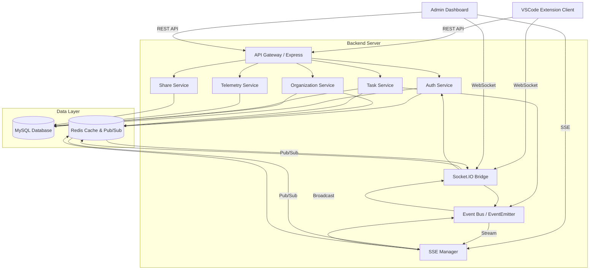
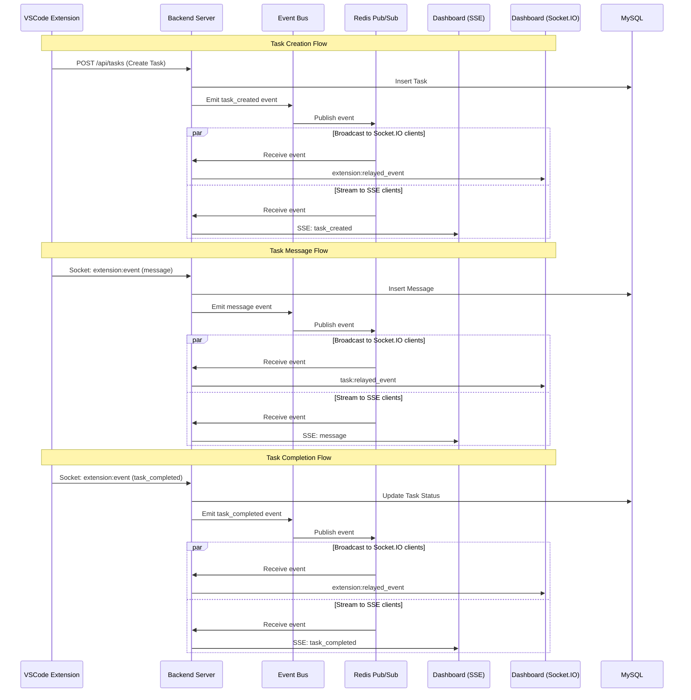

# Design Document

## Overview

本设计文档描述了一个基于 TypeScript + Node.js 的后端服务器系统，包含 RESTful API、实时通信、数据持久化和管理后台。系统采用微服务架构思想，使用 Express.js 作为 Web 框架，MySQL 作为主数据库，Redis 作为缓存和会话存储，Socket.IO 提供实时通信能力。

### Technology Stack

- **Runtime**: Node.js 18+
- **Language**: TypeScript 5+
- **Web Framework**: Express.js
- **Database**: MySQL 8.0+
- **Cache**: Redis 7.0+
- **Real-time**: Socket.IO
- **ORM**: TypeORM
- **Authentication**: jsonwebtoken
- **Validation**: Zod
- **Dashboard**: React + Next.js + Ant Design / shadcn/ui

## Architecture

### High-Level Architecture



### Communication Flow



### Directory Structure

```
backend-server/
├── src/
│   ├── config/              # 配置文件
│   │   ├── database.ts      # 数据库配置
│   │   ├── redis.ts         # Redis 配置
│   │   └── env.ts           # 环境变量
│   ├── entities/            # TypeORM 实体
│   │   ├── User.ts
│   │   ├── Organization.ts
│   │   ├── OrganizationMembership.ts
│   │   ├── Task.ts
│   │   ├── TaskMessage.ts
│   │   ├── Share.ts
│   │   └── TelemetryEvent.ts
│   ├── services/            # 业务逻辑服务
│   │   ├── AuthService.ts
│   │   ├── OrganizationService.ts
│   │   ├── TaskService.ts
│   │   ├── TelemetryService.ts
│   │   ├── ShareService.ts
│   │   └── SettingsService.ts
│   ├── controllers/         # API 控制器
│   │   ├── AuthController.ts
│   │   ├── OrganizationController.ts
│   │   ├── TaskController.ts
│   │   ├── TelemetryController.ts
│   │   ├── ShareController.ts
│   │   └── SettingsController.ts
│   ├── middleware/          # Express 中间件
│   │   ├── auth.ts          # JWT 验证
│   │   ├── errorHandler.ts  # 错误处理
│   │   ├── logger.ts        # 请求日志
│   │   └── validation.ts    # 请求验证
│   ├── routes/              # 路由定义
│   │   ├── auth.ts
│   │   ├── organizations.ts
│   │   ├── tasks.ts
│   │   ├── telemetry.ts
│   │   ├── share.ts
│   │   └── settings.ts
│   ├── socket/              # Socket.IO 处理
│   │   ├── SocketBridge.ts
│   │   └── handlers/
│   ├── utils/               # 工具函数
│   │   ├── jwt.ts
│   │   ├── cache.ts
│   │   └── logger.ts
│   ├── types/               # TypeScript 类型定义
│   │   └── index.ts
│   ├── app.ts               # Express 应用配置
│   └── server.ts            # 服务器入口
├── dashboard/               # 管理后台 (Next.js)
│   ├── src/
│   │   ├── app/             # Next.js App Router
│   │   │   ├── (dashboard)/ # Dashboard layout group
│   │   │   │   ├── layout.tsx
│   │   │   │   ├── page.tsx # Overview
│   │   │   │   ├── users/
│   │   │   │   ├── organizations/
│   │   │   │   ├── tasks/
│   │   │   │   ├── telemetry/
│   │   │   │   └── settings/
│   │   │   ├── api/         # API routes (proxy to backend)
│   │   │   ├── layout.tsx
│   │   │   └── page.tsx
│   │   ├── components/      # React 组件
│   │   ├── lib/             # 工具函数和配置
│   │   │   ├── api.ts       # API 客户端
│   │   │   └── utils.ts
│   │   └── hooks/           # React Hooks
│   ├── public/
│   ├── next.config.js
│   ├── tsconfig.json
│   └── package.json
├── migrations/              # 数据库迁移
├── package.json
├── tsconfig.json
└── .env.example
```

## Integration with @roo-code/types

为了与现有 Roo Cloud 客户端无缝整合，后端服务器将复用 `@roo-code/types` 包中定义的所有类型和 Zod schemas。

### Type System Reuse

**核心类型复用**:

```typescript
import {
	// Cloud Types
	ExtensionInstance,
	ExtensionTask,
	ExtensionBridgeEvent,
	ExtensionBridgeCommand,
	TaskBridgeEvent,
	TaskBridgeCommand,

	// Message Types
	ClineMessage,
	TokenUsage,
	QueuedMessage,

	// Settings Types
	OrganizationSettings,
	UserSettingsData,
	UserFeatures,
	UserSettingsConfig,

	// Telemetry Types
	TelemetryEvent,
	RooCodeTelemetryEvent,

	// Schemas for Validation
	extensionInstanceSchema,
	extensionTaskSchema,
	clineMessageSchema,
	tokenUsageSchema,
	organizationSettingsSchema,
	userSettingsDataSchema,
	extensionBridgeEventSchema,
	taskBridgeEventSchema,
} from "@roo-code/types"
```

### Socket Event Integration

**Extension Socket Events** (from `@roo-code/types`):

- `extension:connected`: 扩展实例连接成功
- `extension:register`: 注册扩展实例
- `extension:unregister`: 注销扩展实例
- `extension:heartbeat`: 心跳更新
- `extension:event`: 扩展实例事件（发送）
- `extension:relayed_event`: 中继事件（接收）
- `extension:command`: 用户命令（接收）
- `extension:relayed_command`: 中继命令（发送）

**Task Socket Events** (from `@roo-code/types`):

- `task:join`: 加入任务房间
- `task:leave`: 离开任务房间
- `task:event`: 任务事件（发送）
- `task:relayed_event`: 中继事件（接收）
- `task:command`: 用户命令（接收）
- `task:relayed_command`: 中继命令（发送）

### SSE (Server-Sent Events) Support

除了 Socket.IO 实时通信，后端还支持 SSE 用于单向事件流推送，特别适合任务执行过程的实时监控。

**SSE Endpoints**:

```typescript
// 订阅任务事件流
GET /api/tasks/:taskId/events
// 订阅用户所有任务事件流
GET /api/users/:userId/task-events
// 订阅组织任务事件流
GET /api/organizations/:orgId/task-events
```

**SSE Event Format**:

```typescript
interface SSEEvent {
	event: string // 事件类型
	data: string // JSON 字符串
	id?: string // 事件 ID（用于断线重连）
	retry?: number // 重连延迟（毫秒）
}
```

**SSE Event Types** (复用 `ExtensionBridgeEventName`):

- `task_created`
- `task_started`
- `task_completed`
- `task_aborted`
- `task_active`
- `task_interactive`
- `task_idle`
- `message` (任务消息更新)
- `token_usage_updated`

**SSE Implementation**:

```typescript
// src/controllers/TaskController.ts
export async function streamTaskEvents(req: Request, res: Response) {
	const { taskId } = req.params
	const userId = req.user!.id

	// 验证权限
	const task = await taskService.getTask(taskId, userId)
	if (!task) {
		return res.status(404).json({ error: "Task not found" })
	}

	// 设置 SSE headers
	res.setHeader("Content-Type", "text/event-stream")
	res.setHeader("Cache-Control", "no-cache")
	res.setHeader("Connection", "keep-alive")
	res.setHeader("X-Accel-Buffering", "no") // Nginx 支持

	// 发送初始连接事件
	res.write(`event: connected\n`)
	res.write(`data: ${JSON.stringify({ taskId, timestamp: Date.now() })}\n\n`)

	// 订阅 Redis pub/sub 或 EventEmitter
	const eventHandler = (event: ExtensionBridgeEvent) => {
		if (event.instance.task.taskId === taskId) {
			res.write(`event: ${event.type}\n`)
			res.write(`data: ${JSON.stringify(event)}\n`)
			res.write(`id: ${event.timestamp}\n\n`)
		}
	}

	taskEventEmitter.on("task-event", eventHandler)

	// 客户端断开连接时清理
	req.on("close", () => {
		taskEventEmitter.off("task-event", eventHandler)
		res.end()
	})

	// 心跳保持连接
	const heartbeat = setInterval(() => {
		res.write(": heartbeat\n\n")
	}, 30000)

	req.on("close", () => {
		clearInterval(heartbeat)
	})
}
```

**Client-Side SSE Usage**:

```typescript
// Dashboard 中使用 SSE
const eventSource = new EventSource(`/api/tasks/${taskId}/events`)

eventSource.addEventListener("message", (e) => {
	const event = JSON.parse(e.data)
	// 更新 UI
	updateTaskMessage(event.instance.task)
})

eventSource.addEventListener("task_completed", (e) => {
	const event = JSON.parse(e.data)
	// 任务完成处理
	handleTaskCompleted(event.instance.task)
})

eventSource.onerror = (error) => {
	console.error("SSE error:", error)
	eventSource.close()
}
```

为了与现有 Roo Cloud 系统无缝整合，后端服务器将复用 `@roo-code/types` 包中定义的类型和契约：

### 复用的核心类型

```typescript
import {
	// JWT 和用户信息
	JWTPayload,
	CloudUserInfo,
	CloudOrganization,
	CloudOrganizationMembership,

	// 组织设置
	OrganizationSettings,
	OrganizationAllowList,
	OrganizationFeatures,
	UserSettingsData,
	UserFeatures,
	UserSettingsConfig,

	// 共享
	ShareVisibility,
	ShareResponse,
	shareResponseSchema,

	// Socket 事件
	ExtensionBridgeEventName,
	ExtensionBridgeEvent,
	extensionBridgeEventSchema,
	ExtensionSocketEvents,
	TaskSocketEvents,
	ExtensionInstance,
	extensionInstanceSchema,

	// 任务和消息
	ExtensionTask,
	ClineMessage,
	clineMessageSchema,
	TokenUsage,
	tokenUsageSchema,
	QueuedMessage,
	queuedMessageSchema,

	// 遥测
	TelemetryEvent,
	TelemetryEventName,
	RooCodeTelemetryEvent,
	rooCodeTelemetryEventSchema,
	TelemetryProperties,

	// 任务状态
	TaskStatus,
} from "@roo-code/types"
```

### 整合策略

1. **类型定义**: 直接使用 @roo-code/types 中的类型，避免重复定义
2. **Zod 验证**: 使用现有的 Zod schemas 进行请求验证
3. **Socket 事件**: 使用 ExtensionBridgeEventName 和 TaskSocketEvents 枚举
4. **JWT Payload**: 遵循现有的 JWTPayload 结构（包含 v, r.u, r.o, r.t 字段）
5. **消息格式**: 使用 ClineMessage 格式存储任务消息

## Components and Interfaces

### 1. Authentication Service

**职责**: 处理用户认证、JWT token 生成和验证、会话管理

**接口**: 复用 @roo-code/types 的类型

```typescript
import { JWTPayload, CloudUserInfo, CloudOrganizationMembership } from "@roo-code/types"

interface IAuthService {
	// 用户注册
	register(email: string, password: string, name: string): Promise<AuthResponse>

	// 用户登录
	login(email: string, password: string): Promise<AuthResponse>

	// 验证 token
	verifyToken(token: string): Promise<JWTPayload>

	// 刷新 token
	refreshToken(refreshToken: string): Promise<AuthResponse>

	// 登出
	logout(token: string): Promise<void>

	// 切换组织
	switchOrganization(userId: string, organizationId: string): Promise<AuthResponse>

	// 生成 job token（用于 CI/CD）
	generateJobToken(userId: string, organizationId: string, jobId: string): Promise<string>

	// 获取用户组织成员关系
	getOrganizationMemberships(userId: string): Promise<CloudOrganizationMembership[]>

	// 验证密码
	validatePassword(plainPassword: string, hashedPassword: string): Promise<boolean>

	// 哈希密码
	hashPassword(password: string): Promise<string>
}

interface AuthResponse {
	accessToken: string
	refreshToken: string
	expiresIn: number
	user: CloudUserInfo
}
```

**实现细节**:

- 使用 `jsonwebtoken` 生成和验证 JWT
- JWT Payload 遵循 @roo-code/types 的 JWTPayload 结构:
    ```typescript
    {
      iss: 'rcc',
      sub: userId,  // 用户 ID
      exp: expirationTime,
      iat: issuedAtTime,
      v: 1,  // 版本号
      r: {
        u: userId,  // 用户 ID
        o: organizationId,  // 组织 ID（可选）
        t: 'auth'  // token 类型: 'auth' 或 'cj' (job token)
      }
    }
    ```
- 使用 `bcrypt` 哈希密码（salt rounds: 10）
- Access token 有效期: 1 小时
- Refresh token 有效期: 7 天
- 在 Redis 中存储活跃会话: `session:{token}` -> `{userId, organizationId, createdAt}`
- 在 Redis 中存储 refresh token: `refresh:{token}` -> `{userId}` (TTL: 7天)
- 登出时从 Redis 删除会话记录和 refresh token
- Token 刷新流程:
    1. 验证 refresh token 有效性
    2. 从 Redis 获取关联的 userId
    3. 生成新的 access token 和 refresh token
    4. 删除旧的 refresh token
    5. 存储新的 refresh token 到 Redis

### 2. Organization Service

**职责**: 管理组织、成员关系、组织设置

**接口**: 复用 @roo-code/types 的类型

```typescript
import {
	CloudOrganization,
	CloudOrganizationMembership,
	OrganizationSettings,
	OrganizationAllowList,
} from "@roo-code/types"

interface IOrganizationService {
	// 创建组织
	createOrganization(name: string, creatorId: string): Promise<CloudOrganization>

	// 获取用户的组织列表
	getUserOrganizations(userId: string): Promise<CloudOrganizationMembership[]>

	// 添加成员
	addMember(organizationId: string, userId: string, role: string): Promise<void>

	// 移除成员
	removeMember(organizationId: string, userId: string): Promise<void>

	// 更新组织设置
	updateSettings(organizationId: string, settings: OrganizationSettings): Promise<void>

	// 获取组织设置
	getSettings(organizationId: string): Promise<OrganizationSettings>

	// 验证白名单
	validateAllowList(organizationId: string, email: string): Promise<boolean>
}
```

**实现细节**:

- 组织设置使用 @roo-code/types 的 OrganizationSettings 类型
- 组织设置缓存在 Redis: `org:settings:{orgId}` (TTL: 15分钟)
- 成员关系存储在 `organization_memberships` 表
- 支持的角色: `owner`, `admin`, `member`
- 使用数据库事务确保原子性:
    - 创建组织时，同时创建组织记录和创建者的 owner 成员关系
    - 添加成员时，验证组织存在且用户未加入
    - 移除成员时，检查是否为最后一个 owner（不允许删除）

### 3. Task Service

**职责**: 管理任务元数据、任务消息、任务查询

**接口**: 复用 @roo-code/types 的类型

```typescript
import { ExtensionTask, ClineMessage, TokenUsage, TaskStatus } from "@roo-code/types"

interface ITaskService {
	// 创建任务
	createTask(userId: string, organizationId: string, metadata?: any): Promise<ExtensionTask>

	// 获取任务详情
	getTask(taskId: string, userId: string): Promise<ExtensionTask>

	// 获取用户任务列表
	getUserTasks(userId: string, options: QueryOptions): Promise<PaginatedResult<ExtensionTask>>

	// 添加任务消息
	addMessage(taskId: string, message: ClineMessage): Promise<void>

	// 获取任务消息
	getMessages(taskId: string): Promise<ClineMessage[]>

	// 批量回填消息
	backfillMessages(taskId: string, messages: ClineMessage[]): Promise<void>

	// 更新任务状态
	updateTaskStatus(taskId: string, status: TaskStatus): Promise<void>

	// 更新 token 使用量
	updateTokenUsage(taskId: string, tokenUsage: TokenUsage): Promise<void>
}

interface QueryOptions {
	page?: number
	limit?: number
	sortBy?: string
	sortOrder?: "ASC" | "DESC"
	status?: TaskStatus
}
```

**实现细节**:

- 任务使用 @roo-code/types 的 ExtensionTask 类型
- 消息使用 @roo-code/types 的 ClineMessage 类型
- 任务元数据存储在 `tasks` 表
- 任务消息存储在 `task_messages` 表（JSON 格式存储 ClineMessage）
- 最近访问的任务缓存在 Redis: `task:{taskId}` (TTL: 5分钟)
- 支持分页查询，默认每页 20 条

### 4. Telemetry Service

**职责**: 收集和存储遥测事件、生成统计数据

**接口**: 复用 @roo-code/types 的类型

```typescript
import { TelemetryEvent, TelemetryEventName, RooCodeTelemetryEvent, TelemetryProperties } from "@roo-code/types"

interface ITelemetryService {
	// 记录事件
	captureEvent(event: RooCodeTelemetryEvent): Promise<void>

	// 批量记录事件
	captureBatch(events: RooCodeTelemetryEvent[]): Promise<void>

	// 获取统计数据
	getStats(organizationId: string, dateRange: DateRange): Promise<Stats>

	// 获取用户活动
	getUserActivity(userId: string, dateRange: DateRange): Promise<Activity[]>
}
```

**实现细节**:

- 事件使用 @roo-code/types 的 RooCodeTelemetryEvent 类型
- 使用 rooCodeTelemetryEventSchema 验证事件数据
- 事件存储在 `telemetry_events` 表
- 聚合统计缓存在 Redis: `stats:{type}:{date}` (TTL: 1天)
- 使用批量插入优化性能
- 异步处理，不阻塞主请求

### 5. Share Service

**职责**: 管理任务共享、权限验证

**接口**: 复用 @roo-code/types 的类型

```typescript
import { ShareVisibility, ShareResponse } from "@roo-code/types"

interface IShareService {
	// 创建共享
	createShare(taskId: string, userId: string, visibility: ShareVisibility): Promise<ShareResponse>

	// 获取共享任务
	getSharedTask(shareUrl: string, requestUserId?: string): Promise<SharedTask>

	// 验证访问权限
	validateAccess(shareUrl: string, userId?: string): Promise<boolean>

	// 删除共享
	deleteShare(shareUrl: string, userId: string): Promise<void>
}
```

**实现细节**:

- 使用 @roo-code/types 的 ShareVisibility 和 ShareResponse 类型
- 使用 shareResponseSchema 验证响应数据
- 共享记录存储在 `shares` 表
- 生成唯一的短链接: `https://api.example.com/share/{shortId}`
- `organization` 可见性: 验证请求用户与任务所有者在同一组织
- `public` 可见性: 任何人都可访问

### 6. Settings Service

**职责**: 管理用户设置、合并组织和用户级设置

**接口**: 复用 @roo-code/types 的类型

```typescript
import { UserSettingsData, UserSettingsConfig, UserFeatures, OrganizationSettings } from "@roo-code/types"

interface ISettingsService {
	// 获取用户设置
	getUserSettings(userId: string): Promise<UserSettingsData>

	// 更新用户设置
	updateUserSettings(userId: string, settings: Partial<UserSettingsConfig>): Promise<void>

	// 获取合并后的设置（组织 + 用户）
	getMergedSettings(userId: string, organizationId: string): Promise<MergedSettings>

	// 获取用户功能开关
	getUserFeatures(userId: string, organizationId: string): Promise<UserFeatures>

	// 检查任务同步是否启用
	isTaskSyncEnabled(userId: string, organizationId: string): Promise<boolean>
}

interface MergedSettings {
	organizationSettings: OrganizationSettings
	userSettings: UserSettingsData
}
```

**实现细节**:

- 使用 @roo-code/types 的 UserSettingsData 和 UserSettingsConfig 类型
- 用户设置存储在 `users` 表的 `settings` JSON 字段
- 设置缓存在 Redis: `user:settings:{userId}` (TTL: 15分钟)
- 组织设置优先级高于用户设置

### 7. Socket Bridge

**职责**: 管理 WebSocket 连接、实时推送更新

**接口**: 复用 @roo-code/types 的事件类型

```typescript
import {
	ExtensionBridgeEvent,
	ExtensionBridgeCommand,
	TaskBridgeEvent,
	TaskBridgeCommand,
	ExtensionSocketEvents,
	TaskSocketEvents,
	ExtensionInstance,
} from "@roo-code/types"

interface ISocketBridge {
	// 初始化 Socket.IO 服务器
	initialize(httpServer: Server): void

	// Extension 实例管理
	registerExtension(instance: ExtensionInstance): Promise<void>
	unregisterExtension(instanceId: string): Promise<void>

	// 广播 Extension 事件
	broadcastExtensionEvent(event: ExtensionBridgeEvent): void

	// 发送命令到 Extension
	sendCommandToExtension(instanceId: string, command: ExtensionBridgeCommand): void

	// Task 事件管理
	broadcastTaskEvent(taskId: string, event: TaskBridgeEvent): void

	// 发送命令到 Task
	sendCommandToTask(taskId: string, command: TaskBridgeCommand): void

	// 获取在线用户
	getOnlineUsers(organizationId: string): Promise<string[]>

	// 获取在线 Extension 实例
	getOnlineInstances(userId: string): Promise<ExtensionInstance[]>
}
```

**实现细节**:

- 使用 @roo-code/types 的 Socket 事件枚举和类型
- 连接时验证 JWT token
- 在 Redis 中维护用户-socket 映射: `socket:user:{userId}` -> `[socketId1, socketId2]`
- 在 Redis 中维护在线状态: `online:{userId}` (TTL: 5分钟，心跳更新)
- 在 Redis 中存储 Extension 实例: `instance:{instanceId}` (TTL: 60秒)
- 支持的 Extension Socket 事件:
    - `ExtensionSocketEvents.CONNECTED`: 连接成功
    - `ExtensionSocketEvents.REGISTER`: 注册实例
    - `ExtensionSocketEvents.UNREGISTER`: 注销实例
    - `ExtensionSocketEvents.HEARTBEAT`: 心跳
    - `ExtensionSocketEvents.EVENT`: Extension 事件
    - `ExtensionSocketEvents.RELAYED_EVENT`: 中继事件
    - `ExtensionSocketEvents.COMMAND`: 用户命令
    - `ExtensionSocketEvents.RELAYED_COMMAND`: 中继命令
- 支持的 Task Socket 事件:
    - `TaskSocketEvents.JOIN`: 加入任务房间
    - `TaskSocketEvents.LEAVE`: 离开任务房间
    - `TaskSocketEvents.EVENT`: Task ���件
    - `TaskSocketEvents.RELAYED_EVENT`: 中继事件
    - `TaskSocketEvents.COMMAND`: 用户命令
    - `TaskSocketEvents.RELAYED_COMMAND`: 中继命令

本后端服务器将复用 `@roo-code/types` 包中的类型定义和 Zod schemas，确保与现有 Roo Cloud 客户端的完全兼容性。

### 复用的核心类型

```typescript
// 从 @roo-code/types 导入
import {
	// JWT 和认证
	JWTPayload,
	CloudUserInfo,
	CloudOrganization,
	CloudOrganizationMembership,
	AuthState,

	// 组织设置
	OrganizationSettings,
	OrganizationAllowList,
	OrganizationFeatures,
	organizationSettingsSchema,

	// 用户设置
	UserSettingsData,
	UserFeatures,
	UserSettingsConfig,
	userSettingsDataSchema,

	// 任务共享
	ShareVisibility,
	ShareResponse,
	shareResponseSchema,

	// 扩展实例和事件
	ExtensionInstance,
	ExtensionTask,
	extensionInstanceSchema,
	ExtensionBridgeEventName,
	ExtensionBridgeEvent,
	extensionBridgeEventSchema,
	ExtensionSocketEvents,

	// 任务事件
	TaskBridgeEventName,
	TaskBridgeEvent,
	taskBridgeEventSchema,
	TaskSocketEvents,

	// 消息类型
	ClineMessage,
	clineMessageSchema,
	TokenUsage,
	tokenUsageSchema,

	// 遥测
	TelemetryEvent,
	TelemetryEventName,
	RooCodeTelemetryEvent,
	rooCodeTelemetryEventSchema,
	TelemetryProperties,

	// 任务相关
	TaskStatus,
	taskMetadataSchema,
} from "@roo-code/types"
```

### Socket.IO 事件契约

后端将实现与现有客户端完全兼容的 Socket.IO 事件系统：

**Extension Socket Events** (用于扩展实例管理):

- `extension:connected` - 连接建立
- `extension:register` - 注册扩展实例
- `extension:unregister` - 注销扩展实例
- `extension:heartbeat` - 心跳更新
- `extension:event` - 扩展实例事件（发送）
- `extension:relayed_event` - 中继事件（接收）
- `extension:command` - 用户命令（接收）
- `extension:relayed_command` - 中继命令（发送）

**Task Socket Events** (用于任务级别通信):

- `task:join` - 加入任务房间
- `task:leave` - 离开任务房间
- `task:event` - 任务事件（发送）
- `task:relayed_event` - 中继事件（接收）
- `task:command` - 任务命令（接收）
- `task:relayed_command` - 中继命令（发送）

### Extension Bridge Events

支持的扩展桥接事件（使用 `ExtensionBridgeEventName` 枚举）：

```typescript
// 任务生命周期事件
;-TaskCreated -
	TaskStarted -
	TaskCompleted -
	TaskAborted -
	TaskFocused -
	TaskUnfocused -
	TaskActive -
	TaskInteractive -
	TaskResumable -
	TaskIdle -
	TaskPaused -
	TaskUnpaused -
	TaskSpawned -
	// 任务更新事件
	TaskUserMessage -
	TaskTokenUsageUpdated -
	// 配置变更事件
	ModeChanged -
	ProviderProfileChanged -
	// 实例管理事件
	InstanceRegistered -
	InstanceUnregistered -
	HeartbeatUpdated
```

### SSE (Server-Sent Events) 支持

除了 Socket.IO，还将支持 SSE 用于实时任务执行流：

```typescript
// SSE 端点
GET /api/tasks/:taskId/stream

// 事件格式
event: message
data: {"type": "task_started", "taskId": "xxx", "timestamp": 1234567890}

event: message
data: {"type": "cline_message", "message": {...}, "timestamp": 1234567890}

event: message
data: {"type": "task_completed", "taskId": "xxx", "timestamp": 1234567890}
```

## Components and Interfaces

### 1. Authentication Service

**职责**: 处理用户认证、JWT token 生成和验证、会话管理

**接口**: 复用 @roo-code/types 的 JWTPayload 和 CloudUserInfo

```typescript
import { JWTPayload, CloudUserInfo } from "@roo-code/types"

interface IAuthService {
	// 用户注册
	register(email: string, password: string, name: string): Promise<AuthResponse>

	// 用户登录
	login(email: string, password: string): Promise<AuthResponse>

	// 验证 token
	verifyToken(token: string): Promise<JWTPayload>

	// 刷新 token
	refreshToken(refreshToken: string): Promise<AuthResponse>

	// 登出
	logout(token: string): Promise<void>

	// 切换组织
	switchOrganization(userId: string, organizationId: string): Promise<AuthResponse>

	// 生成 job token（用于 CI/CD）
	generateJobToken(userId: string, organizationId: string, jobId: string): Promise<string>

	// 验证密码
	validatePassword(plainPassword: string, hashedPassword: string): Promise<boolean>

	// 哈希密码
	hashPassword(password: string): Promise<string>
}

interface AuthResponse {
	accessToken: string
	refreshToken: string
	expiresIn: number
	user: CloudUserInfo
}

// 使用 @roo-code/types 的 JWTPayload
// export interface JWTPayload {
//   iss?: string // Issuer (should be 'rcc')
//   sub?: string // Subject - CloudJob ID for job tokens (t:'cj'), User ID for auth tokens (t:'auth')
//   exp?: number // Expiration time
//   iat?: number // Issued at time
//   nbf?: number // Not before time
//   v?: number // Version (should be 1)
//   r?: {
//     u?: string // User ID (always present in valid tokens)
//     o?: string // Organization ID (optional - undefined when orgId is null)
//     t?: string // Token type: 'cj' for job tokens, 'auth' for auth tokens
//   }
// }
```

**实现细节**:

- 使用 `jsonwebtoken` 生成和验证 JWT
- 使用 `bcrypt` 哈希密码（salt rounds: 10）
- Access token 有效期: 1 小时
- Refresh token 有效期: 7 天
- 在 Redis 中存储活跃会话: `session:{token}` -> `{userId, organizationId, createdAt}`
- 在 Redis 中存储 refresh token: `refresh:{token}` -> `{userId}` (TTL: 7天)
- 登出时从 Redis 删除会话记录和 refresh token
- Token 刷新流程:
    1. 验证 refresh token 有效性
    2. 从 Redis 获取关联的 userId
    3. 生成新的 access token 和 refresh token
    4. 删除旧的 refresh token
    5. 存储新的 refresh token 到 Redis

### 2. Organization Service

**职责**: 管理组织、成员关系、组织设置

**接口**: 复用 @roo-code/types 的组织相关类型

```typescript
import {
	CloudOrganization,
	CloudOrganizationMembership,
	OrganizationSettings,
	OrganizationAllowList,
} from "@roo-code/types"

interface IOrganizationService {
	// 创建组织
	createOrganization(name: string, creatorId: string): Promise<CloudOrganization>

	// 获取用户的组织列表
	getUserOrganizations(userId: string): Promise<CloudOrganizationMembership[]>

	// 添加成员
	addMember(organizationId: string, userId: string, role: string): Promise<void>

	// 移除成员
	removeMember(organizationId: string, userId: string): Promise<void>

	// 更新组织设置
	updateSettings(organizationId: string, settings: OrganizationSettings): Promise<void>

	// 获取组织设置
	getSettings(organizationId: string): Promise<OrganizationSettings>

	// 验证白名单
	validateAllowList(organizationId: string, email: string): Promise<boolean>
}

// 使用 @roo-code/types 的 OrganizationSettings
// export interface OrganizationSettings {
//   version: number
//   cloudSettings?: OrganizationCloudSettings
//   defaultSettings: OrganizationDefaultSettings
//   allowList: OrganizationAllowList
//   features?: OrganizationFeatures
//   hiddenMcps?: string[]
//   hideMarketplaceMcps?: boolean
//   mcps?: McpMarketplaceItem[]
//   providerProfiles?: Record<string, ProviderSettingsWithId>
// }
```

**实现细节**:

- 组织设置缓存在 Redis: `org:settings:{orgId}` (TTL: 15分钟)
- 成员关系存储在 `organization_memberships` 表
- 支持的角色: `owner`, `admin`, `member`
- 使用数据库事务确保原子性:
    - 创建组织时，同时创建组织记录和创建者的 owner 成员关系
    - 添加成员时，验证组织存在且用户未加入
    - 移除成员时，检查是否为最后一个 owner（不允许删除）

### 3. Task Service

**职责**: 管理任务元数据、任务消息、任务查询

**接口**:

```typescript
interface ITaskService {
	// 创建任务
	createTask(userId: string, organizationId: string): Promise<Task>

	// 获取任务详情
	getTask(taskId: string, userId: string): Promise<Task>

	// 获取用户任务列表
	getUserTasks(userId: string, options: QueryOptions): Promise<PaginatedResult<Task>>

	// 添加任务消息
	addMessage(taskId: string, message: TaskMessage): Promise<void>

	// 获取任务消息
	getMessages(taskId: string): Promise<TaskMessage[]>

	// 批量回填消息
	backfillMessages(taskId: string, messages: TaskMessage[]): Promise<void>
}

interface QueryOptions {
	page?: number
	limit?: number
	sortBy?: string
	sortOrder?: "ASC" | "DESC"
}
```

**实现细节**:

- 任务元数据存储在 `tasks` 表
- 任务消息存储在 `task_messages` 表
- 最近访问的任务缓存在 Redis: `task:{taskId}` (TTL: 5分钟)
- 支持分页查询，默认每页 20 条

### 4. Telemetry Service

**职责**: 收集和存储遥测事件、生成统计数据

**接口**: 复用 @roo-code/types 的遥测类型

```typescript
import { RooCodeTelemetryEvent, TelemetryEventName, TelemetryProperties, UsageStats } from "@roo-code/types"

interface ITelemetryService {
	// 记录事件（使用 @roo-code/types 的事件格式）
	captureEvent(event: RooCodeTelemetryEvent): Promise<void>

	// 批量记录事件
	captureBatch(events: RooCodeTelemetryEvent[]): Promise<void>

	// 获取统计数据（使用 @roo-code/types 的 UsageStats）
	getStats(organizationId: string, period: number): Promise<UsageStats>

	// 获取用户活动
	getUserActivity(userId: string, dateRange: DateRange): Promise<Activity[]>

	// 回填任务消息（用于任务共享）
	backfillMessages(taskId: string, messages: ClineMessage[]): Promise<void>
}

// 使用 @roo-code/types 的 RooCodeTelemetryEvent
// 支持的事件类型包括：
// - TASK_CREATED, TASK_COMPLETED, TASK_MESSAGE
// - LLM_COMPLETION, MODE_SWITCH, TOOL_USED
// - CHECKPOINT_CREATED, CODE_ACTION_USED
// - SHARE_BUTTON_CLICKED, ACCOUNT_CONNECT_SUCCESS
// 等等...
```

**实现细节**:

- 事件存储在 `telemetry_events` 表
- 聚合统计缓存在 Redis: `stats:{type}:{date}` (TTL: 1天)
- 使用批量插入优化性能
- 异步处理，不阻塞主请求

### 5. Share Service

**职责**: 管理任务共享、权限验证

**接口**:

```typescript
interface IShareService {
	// 创建共享
	createShare(taskId: string, userId: string, visibility: ShareVisibility): Promise<ShareResponse>

	// 获取共享任务
	getSharedTask(shareUrl: string, requestUserId?: string): Promise<SharedTask>

	// 验证访问权限
	validateAccess(shareUrl: string, userId?: string): Promise<boolean>

	// 删除共享
	deleteShare(shareUrl: string, userId: string): Promise<void>
}

type ShareVisibility = "public" | "organization"

interface ShareResponse {
	shareUrl: string
	visibility: ShareVisibility
	createdAt: Date
}
```

**实现细节**:

- 共享记录存储在 `shares` 表
- 生成唯一的短链接: `https://api.example.com/share/{shortId}`
- `organization` 可见性: 验证请求用户与任务所有者在同一组织
- `public` 可见性: 任何人都可访问

### 6. Settings Service

**职责**: 管理用户设置、合并组织和用户级设置

**接口**:

```typescript
interface ISettingsService {
	// 获取用户设置
	getUserSettings(userId: string): Promise<UserSettings>

	// 更新用户设置
	updateUserSettings(userId: string, settings: Partial<UserSettings>): Promise<void>

	// 获取合并后的设置（组织 + 用户）
	getMergedSettings(userId: string, organizationId: string): Promise<MergedSettings>

	// 获取用户功能开关
	getUserFeatures(userId: string, organizationId: string): Promise<UserFeatures>
}

interface UserSettings {
	taskSyncEnabled: boolean
	telemetryEnabled: boolean
	preferences: Record<string, any>
}
```

**实现细节**:

- 用户设置存储在 `users` 表的 `settings` JSON 字段
- 设置缓存在 Redis: `user:settings:{userId}` (TTL: 15分钟)
- 组织设置优先级高于用户设置

### 7. Socket Bridge

**职责**: 管理 WebSocket 连接、实时推送更新、处理扩展实例和任务事件

**接口**: 完全兼容 @roo-code/types 的 Socket 事件契约

```typescript
import {
	ExtensionSocketEvents,
	TaskSocketEvents,
	ExtensionBridgeEvent,
	TaskBridgeEvent,
	ExtensionBridgeCommand,
	TaskBridgeCommand,
	ExtensionInstance,
	JoinResponse,
	LeaveResponse,
} from "@roo-code/types"

interface ISocketBridge {
	// 初始化 Socket.IO 服务器
	initialize(httpServer: Server): void

	// Extension Socket 事件处理
	handleExtensionRegister(socket: Socket, instance: ExtensionInstance): Promise<void>
	handleExtensionUnregister(socket: Socket, instanceId: string): Promise<void>
	handleExtensionHeartbeat(socket: Socket, instanceId: string): Promise<void>
	handleExtensionEvent(socket: Socket, event: ExtensionBridgeEvent): Promise<void>

	// Task Socket 事件处理
	handleTaskJoin(socket: Socket, taskId: string): Promise<JoinResponse>
	handleTaskLeave(socket: Socket, taskId: string): Promise<LeaveResponse>
	handleTaskEvent(socket: Socket, event: TaskBridgeEvent): Promise<void>

	// 命令中继
	relayCommandToExtension(instanceId: string, command: ExtensionBridgeCommand): void
	relayCommandToTask(taskId: string, command: TaskBridgeCommand): void

	// 事件广播
	broadcastExtensionEvent(event: ExtensionBridgeEvent): void
	broadcastTaskEvent(taskId: string, event: TaskBridgeEvent): void

	// 向用户推送消息
	emitToUser(userId: string, event: string, data: any): void

	// 向组织推送消息
	emitToOrganization(organizationId: string, event: string, data: any): void

	// 获取在线用户
	getOnlineUsers(organizationId: string): Promise<string[]>
}
```

**实现细节**:

- 连接时验证 JWT token（从查询参数或握手 auth 中获取）
- 使用 Socket.IO rooms 管理连接:
    - `user:{userId}` - 用户房间
    - `org:{organizationId}` - 组织房间
    - `task:{taskId}` - 任务房间
    - `instance:{instanceId}` - 扩展实例房间
- 在 Redis 中维护扩展实例状态: `instance:{instanceId}` -> ExtensionInstance (TTL: 60秒)
- 在 Redis 中维护用户-socket 映射: `socket:user:{userId}` -> Set<socketId>
- 在 Redis 中维护在线状态: `online:{userId}` (TTL: 5分钟，心跳更新)
- 实现 Socket.IO Redis Adapter 支持多实例部署
- 事件验证使用 Zod schemas（extensionBridgeEventSchema, taskBridgeEventSchema）
- 支持的 Extension Socket 事件（ExtensionSocketEvents）:
    - `extension:connected` - 连接建立确认
    - `extension:register` - 注册扩展实例
    - `extension:unregister` - 注销扩展实例
    - `extension:heartbeat` - 心跳更新（每 20 秒）
    - `extension:event` - 扩展事件（客户端 -> 服务器）
    - `extension:relayed_event` - 中继事件（服务器 -> 客户端）
    - `extension:command` - 用户命令（Dashboard -> 扩展）
    - `extension:relayed_command` - 中继命令（服务器 -> 扩展）
- 支持的 Task Socket 事件（TaskSocketEvents）:
    - `task:join` - 加入任务房间
    - `task:leave` - 离开任务房间
    - `task:event` - 任务事件（扩展 -> 服务器）
    - `task:relayed_event` - 中继事件（服务器 -> Dashboard）
    - `task:command` - 任务命令（Dashboard -> 扩展）
    - `task:relayed_command` - 中继命令（服务器 -> 扩展）

### 8. SSE (Server-Sent Events) Service

**职责**: 提供实时任务执行流，用于 Dashboard 实时监控

**接口**:

```typescript
interface ISSEService {
	// 创建 SSE 连接
	createStream(taskId: string, userId: string, res: Response): void

	// 发送任务事件到 SSE 流
	sendTaskEvent(taskId: string, event: TaskBridgeEvent): void

	// 发送消息到 SSE 流
	sendMessage(taskId: string, message: ClineMessage): void

	// 关闭 SSE 连接
	closeStream(taskId: string, userId: string): void
}
```

**实现细节**:

- SSE 端点: `GET /api/tasks/:taskId/stream`
- 验证用户对任务的访问权限
- 保持连接活跃（每 30 秒发送心跳）
- 事件格式:

    ```
    event: task_event
    data: {"type": "TaskStarted", "instance": {...}, "timestamp": 1234567890}

    event: message
    data: {"type": "say", "say": "text", "text": "...", "ts": 1234567890}

    event: heartbeat
    data: {"timestamp": 1234567890}
    ```

- 在 Redis 中维护活跃 SSE 连接: `sse:task:{taskId}` -> Set<userId>
- 当任务完成或中止时自动关闭所有相关 SSE 连接

## Data Models

### Database Schema (MySQL)

```sql
-- Users table
CREATE TABLE users (
  id VARCHAR(36) PRIMARY KEY,
  email VARCHAR(255) UNIQUE NOT NULL,
  password_hash VARCHAR(255) NOT NULL,
  name VARCHAR(255),
  settings JSON,
  created_at TIMESTAMP DEFAULT CURRENT_TIMESTAMP,
  updated_at TIMESTAMP DEFAULT CURRENT_TIMESTAMP ON UPDATE CURRENT_TIMESTAMP,
  INDEX idx_email (email)
);

-- Organizations table
CREATE TABLE organizations (
  id VARCHAR(36) PRIMARY KEY,
  name VARCHAR(255) NOT NULL,
  settings JSON,
  created_at TIMESTAMP DEFAULT CURRENT_TIMESTAMP,
  updated_at TIMESTAMP DEFAULT CURRENT_TIMESTAMP ON UPDATE CURRENT_TIMESTAMP,
  INDEX idx_name (name)
);

-- Organization memberships table
CREATE TABLE organization_memberships (
  id VARCHAR(36) PRIMARY KEY,
  user_id VARCHAR(36) NOT NULL,
  organization_id VARCHAR(36) NOT NULL,
  role ENUM('owner', 'admin', 'member') NOT NULL,
  joined_at TIMESTAMP DEFAULT CURRENT_TIMESTAMP,
  FOREIGN KEY (user_id) REFERENCES users(id) ON DELETE CASCADE,
  FOREIGN KEY (organization_id) REFERENCES organizations(id) ON DELETE CASCADE,
  UNIQUE KEY unique_membership (user_id, organization_id),
  INDEX idx_user_id (user_id),
  INDEX idx_organization_id (organization_id)
);

-- Tasks table
CREATE TABLE tasks (
  id VARCHAR(36) PRIMARY KEY,
  user_id VARCHAR(36) NOT NULL,
  organization_id VARCHAR(36) NOT NULL,
  metadata JSON,
  created_at TIMESTAMP DEFAULT CURRENT_TIMESTAMP,
  updated_at TIMESTAMP DEFAULT CURRENT_TIMESTAMP ON UPDATE CURRENT_TIMESTAMP,
  FOREIGN KEY (user_id) REFERENCES users(id) ON DELETE CASCADE,
  FOREIGN KEY (organization_id) REFERENCES organizations(id) ON DELETE CASCADE,
  INDEX idx_user_id (user_id),
  INDEX idx_organization_id (organization_id),
  INDEX idx_created_at (created_at)
);

-- Task messages table
CREATE TABLE task_messages (
  id VARCHAR(36) PRIMARY KEY,
  task_id VARCHAR(36) NOT NULL,
  type VARCHAR(50) NOT NULL,
  content JSON NOT NULL,
  timestamp TIMESTAMP DEFAULT CURRENT_TIMESTAMP,
  FOREIGN KEY (task_id) REFERENCES tasks(id) ON DELETE CASCADE,
  INDEX idx_task_id (task_id),
  INDEX idx_timestamp (timestamp)
);

-- Shares table
CREATE TABLE shares (
  id VARCHAR(36) PRIMARY KEY,
  task_id VARCHAR(36) NOT NULL,
  share_url VARCHAR(255) UNIQUE NOT NULL,
  visibility ENUM('public', 'organization') NOT NULL,
  created_by VARCHAR(36) NOT NULL,
  created_at TIMESTAMP DEFAULT CURRENT_TIMESTAMP,
  FOREIGN KEY (task_id) REFERENCES tasks(id) ON DELETE CASCADE,
  FOREIGN KEY (created_by) REFERENCES users(id) ON DELETE CASCADE,
  INDEX idx_share_url (share_url),
  INDEX idx_task_id (task_id)
);

-- Telemetry events table
CREATE TABLE telemetry_events (
  id VARCHAR(36) PRIMARY KEY,
  user_id VARCHAR(36) NOT NULL,
  organization_id VARCHAR(36) NOT NULL,
  event_type VARCHAR(100) NOT NULL,
  event_data JSON,
  timestamp TIMESTAMP DEFAULT CURRENT_TIMESTAMP,
  FOREIGN KEY (user_id) REFERENCES users(id) ON DELETE CASCADE,
  FOREIGN KEY (organization_id) REFERENCES organizations(id) ON DELETE CASCADE,
  INDEX idx_user_id (user_id),
  INDEX idx_organization_id (organization_id),
  INDEX idx_event_type (event_type),
  INDEX idx_timestamp (timestamp)
);
```

### TypeORM Entities

```typescript
@Entity("users")
export class User {
	@PrimaryColumn()
	id: string

	@Column({ unique: true })
	email: string

	@Column({ name: "password_hash" })
	passwordHash: string

	@Column({ nullable: true })
	name: string

	@Column({ type: "json", nullable: true })
	settings: Record<string, any>

	@CreateDateColumn({ name: "created_at" })
	createdAt: Date

	@UpdateDateColumn({ name: "updated_at" })
	updatedAt: Date

	@OneToMany(() => OrganizationMembership, (membership) => membership.user)
	memberships: OrganizationMembership[]

	@OneToMany(() => Task, (task) => task.user)
	tasks: Task[]
}
```

### Redis Data Structures

```typescript
// Session storage
// Key: session:{token}
// Value: { userId, organizationId, createdAt }
// TTL: 3600 seconds (1 hour)

// User settings cache
// Key: user:settings:{userId}
// Value: JSON string of user settings
// TTL: 900 seconds (15 minutes)

// Organization settings cache
// Key: org:settings:{orgId}
// Value: JSON string of organization settings
// TTL: 900 seconds (15 minutes)

// Online users
// Key: online:{userId}
// Value: timestamp
// TTL: 300 seconds (5 minutes, updated by heartbeat)

// Socket connections
// Key: socket:user:{userId}
// Value: Set of socket IDs
// TTL: None (removed on disconnect)

// Statistics cache
// Key: stats:{type}:{date}
// Value: JSON string of aggregated stats
// TTL: 86400 seconds (1 day)
```

## API Endpoints

### Authentication

```
POST   /api/auth/register              # 用户注册
POST   /api/auth/login                 # 用户登录
POST   /api/auth/logout                # 用户登出
POST   /api/auth/refresh               # 刷新 token
POST   /api/auth/switch-organization   # 切换组织
GET    /api/auth/me                    # 获取当前用户信息
GET    /api/auth/organizations         # 获取用户的组织成员关系
```

### Organizations

```
GET    /api/organizations
GET    /api/organizations/:id
POST   /api/organizations
PUT    /api/organizations/:id
GET    /api/organizations/:id/members
POST   /api/organizations/:id/members
DELETE /api/organizations/:id/members/:userId
```

### Tasks

```
GET    /api/tasks
GET    /api/tasks/:id
POST   /api/tasks
GET    /api/tasks/:id/messages
POST   /api/tasks/:id/messages
POST   /api/tasks/:id/backfill
```

### Settings

```
GET    /api/settings
PUT    /api/settings
GET    /api/settings/features
```

### Share

```
POST   /api/extension/share
GET    /api/share/:shareUrl
DELETE /api/share/:shareUrl
```

### Telemetry

```
POST   /api/telemetry/events
POST   /api/telemetry/batch
GET    /api/telemetry/stats
```

### Bridge

```
GET    /api/extension/bridge/config
```

## Dashboard Design

### Pages

1. **Dashboard Overview (数据看板)**

    - 系统统计卡片（用户数、组织数、任务数、今日活跃）
    - 活跃用户趋势图表（7天/30天）
    - Token 使用量和成本趋势
    - 最近任务列表
    - 实时在线用户数

    **示例布局**:

    ```tsx
    // app/(dashboard)/page.tsx
    export default async function DashboardPage() {
    	const stats = await getStats()

    	return (
    		<div className="space-y-6">
    			{/* 统计卡片 */}
    			<div className="grid grid-cols-1 md:grid-cols-2 lg:grid-cols-4 gap-4">
    				<StatCard title="Total Users" value={stats.totalUsers} change="+12%" icon={<UsersIcon />} />
    				<StatCard title="Active Tasks" value={stats.activeTasks} change="+5%" icon={<TaskIcon />} />
    				<StatCard
    					title="Token Usage (7d)"
    					value={formatNumber(stats.tokenUsage)}
    					change="-3%"
    					icon={<TokenIcon />}
    				/>
    				<StatCard
    					title="Total Cost (7d)"
    					value={`$${stats.totalCost.toFixed(2)}`}
    					change="+8%"
    					icon={<DollarIcon />}
    				/>
    			</div>

    			{/* 趋势图表 */}
    			<div className="grid grid-cols-1 lg:grid-cols-2 gap-6">
    				<Card>
    					<CardHeader>
    						<CardTitle>Token Usage Trend</CardTitle>
    					</CardHeader>
    					<CardContent>
    						<LineChart data={stats.tokenTrend} />
    					</CardContent>
    				</Card>

    				<Card>
    					<CardHeader>
    						<CardTitle>Active Users</CardTitle>
    					</CardHeader>
    					<CardContent>
    						<BarChart data={stats.activeUsersTrend} />
    					</CardContent>
    				</Card>
    			</div>

    			{/* 最近任务 */}
    			<Card>
    				<CardHeader>
    					<CardTitle>Recent Tasks</CardTitle>
    				</CardHeader>
    				<CardContent>
    					<RecentTasksList tasks={stats.recentTasks} />
    				</CardContent>
    			</Card>
    		</div>
    	)
    }
    ```

2. **Users Management**

    - 用户列表表格（搜索、筛选、分页）
    - 用户详情弹窗
    - 用户组织关系
    - 用户活动统计

3. **Organizations Management**

    - 组织列表表格
    - 组织详情和设置
    - 成员管理
    - 组织级别统计

4. **Tasks Explorer (任务看板)**

    - 任务列表（按用户、组织、时间、状态筛选）
    - 实时任务状态更新
    - 任务详情查看
    - 任务消息时间线（实时对话流）
    - Token 使用统计

    **示例布局**:

    ```tsx
    // app/(dashboard)/tasks/page.tsx
    "use client"

    export default function TasksPage() {
    	const [tasks, setTasks] = useState<ExtensionTask[]>([])
    	const [filters, setFilters] = useState({
    		status: "all",
    		creator: "all",
    		organization: "all",
    		timeRange: "last-7-days",
    	})

    	// 实时更新任务状态
    	useEffect(() => {
    		const socket = io("/api/socket")

    		socket.on("extension:relayed_event", (event: ExtensionBridgeEvent) => {
    			if (event.type === "task_started" || event.type === "task_completed" || event.type === "task_aborted") {
    				updateTaskInList(event.instance.task)
    			}
    		})

    		return () => socket.disconnect()
    	}, [])

    	return (
    		<div className="space-y-6">
    			{/* 筛选器 */}
    			<Card>
    				<CardContent className="pt-6">
    					<div className="grid grid-cols-1 md:grid-cols-4 gap-4">
    						<Select value={filters.status} onValueChange={(v) => setFilters({ ...filters, status: v })}>
    							<SelectTrigger>
    								<SelectValue placeholder="All Status" />
    							</SelectTrigger>
    							<SelectContent>
    								<SelectItem value="all">All Status</SelectItem>
    								<SelectItem value="active">Active</SelectItem>
    								<SelectItem value="completed">Completed</SelectItem>
    								<SelectItem value="aborted">Aborted</SelectItem>
    							</SelectContent>
    						</Select>

    						<Select value={filters.creator}>
    							<SelectTrigger>
    								<SelectValue placeholder="Any Creator" />
    							</SelectTrigger>
    							<SelectContent>{/* 用户列表 */}</SelectContent>
    						</Select>

    						<Select value={filters.organization}>
    							<SelectTrigger>
    								<SelectValue placeholder="Any Organization" />
    							</SelectTrigger>
    							<SelectContent>{/* 组织列表 */}</SelectContent>
    						</Select>

    						<Select value={filters.timeRange}>
    							<SelectTrigger>
    								<SelectValue placeholder="Last 7 Days" />
    							</SelectTrigger>
    							<SelectContent>
    								<SelectItem value="last-24-hours">Last 24 Hours</SelectItem>
    								<SelectItem value="last-7-days">Last 7 Days</SelectItem>
    								<SelectItem value="last-30-days">Last 30 Days</SelectItem>
    								<SelectItem value="all-time">All Time</SelectItem>
    							</SelectContent>
    						</Select>
    					</div>
    				</CardContent>
    			</Card>

    			{/* 任务列表 */}
    			<Card>
    				<CardHeader>
    					<CardTitle>Tasks</CardTitle>
    					<CardDescription>{tasks.length} tasks found</CardDescription>
    				</CardHeader>
    				<CardContent>
    					<Table>
    						<TableHeader>
    							<TableRow>
    								<TableHead>Task ID</TableHead>
    								<TableHead>Status</TableHead>
    								<TableHead>Creator</TableHead>
    								<TableHead>Organization</TableHead>
    								<TableHead>Tokens</TableHead>
    								<TableHead>Cost</TableHead>
    								<TableHead>Created</TableHead>
    								<TableHead>Actions</TableHead>
    							</TableRow>
    						</TableHeader>
    						<TableBody>
    							{tasks.map((task) => (
    								<TableRow key={task.taskId}>
    									<TableCell className="font-mono text-sm">
    										{task.taskId.slice(0, 8)}...
    									</TableCell>
    									<TableCell>
    										<TaskStatusBadge status={task.taskStatus} />
    									</TableCell>
    									<TableCell>{task.userId}</TableCell>
    									<TableCell>{task.organizationId}</TableCell>
    									<TableCell>
    										{task.tokenUsage
    											? formatNumber(
    													task.tokenUsage.totalTokensIn + task.tokenUsage.totalTokensOut,
    												)
    											: "-"}
    									</TableCell>
    									<TableCell>
    										{task.tokenUsage ? `$${task.tokenUsage.totalCost.toFixed(4)}` : "-"}
    									</TableCell>
    									<TableCell>{formatDistanceToNow(new Date(task.createdAt))} ago</TableCell>
    									<TableCell>
    										<Button
    											variant="ghost"
    											size="sm"
    											onClick={() => openTaskDetail(task.taskId)}>
    											View
    										</Button>
    									</TableCell>
    								</TableRow>
    							))}
    						</TableBody>
    					</Table>
    				</CardContent>
    			</Card>
    		</div>
    	)
    }
    ```

    **任务详情页面（实时对话查看器）**:

    ```tsx
    // app/(dashboard)/tasks/[taskId]/page.tsx
    "use client"

    export default function TaskDetailPage({ params }: { params: { taskId: string } }) {
    	const [task, setTask] = useState<ExtensionTask | null>(null)
    	const [messages, setMessages] = useState<ClineMessage[]>([])
    	const messagesEndRef = useRef<HTMLDivElement>(null)

    	// 使用 SSE 订阅任务事件
    	useEffect(() => {
    		const eventSource = new EventSource(`/api/tasks/${params.taskId}/events`)

    		eventSource.addEventListener("message", (e) => {
    			const event: TaskBridgeEvent = JSON.parse(e.data)
    			if (event.type === "message") {
    				setMessages((prev) => {
    					const existing = prev.find((m) => m.ts === event.message.ts)
    					if (existing) {
    						// 更新现有消息
    						return prev.map((m) => (m.ts === event.message.ts ? event.message : m))
    					} else {
    						// 添加新消息
    						return [...prev, event.message]
    					}
    				})

    				// 自动滚动到最新消息
    				messagesEndRef.current?.scrollIntoView({ behavior: "smooth" })
    			}
    		})

    		eventSource.addEventListener("task_completed", (e) => {
    			const event: ExtensionBridgeEvent = JSON.parse(e.data)
    			setTask(event.instance.task)
    		})

    		return () => eventSource.close()
    	}, [params.taskId])

    	return (
    		<div className="space-y-6">
    			{/* 任务头部信息 */}
    			<Card>
    				<CardHeader>
    					<div className="flex items-center justify-between">
    						<div>
    							<CardTitle>Task {params.taskId.slice(0, 8)}</CardTitle>
    							<CardDescription>
    								Created {task && formatDistanceToNow(new Date(task.createdAt))} ago
    							</CardDescription>
    						</div>
    						<TaskStatusBadge status={task?.taskStatus} />
    					</div>
    				</CardHeader>
    				<CardContent>
    					<div className="grid grid-cols-2 md:grid-cols-4 gap-4">
    						<div>
    							<div className="text-sm text-muted-foreground">Total Tokens</div>
    							<div className="text-2xl font-bold">
    								{task?.tokenUsage
    									? formatNumber(task.tokenUsage.totalTokensIn + task.tokenUsage.totalTokensOut)
    									: "-"}
    							</div>
    						</div>
    						<div>
    							<div className="text-sm text-muted-foreground">Total Cost</div>
    							<div className="text-2xl font-bold">
    								{task?.tokenUsage ? `$${task.tokenUsage.totalCost.toFixed(4)}` : "-"}
    							</div>
    						</div>
    						<div>
    							<div className="text-sm text-muted-foreground">Messages</div>
    							<div className="text-2xl font-bold">{messages.length}</div>
    						</div>
    						<div>
    							<div className="text-sm text-muted-foreground">Duration</div>
    							<div className="text-2xl font-bold">
    								{task && calculateDuration(task.createdAt, task.updatedAt)}
    							</div>
    						</div>
    					</div>
    				</CardContent>
    			</Card>

    			{/* 实时对话流 */}
    			<Card>
    				<CardHeader>
    					<CardTitle>Conversation</CardTitle>
    					<CardDescription>Real-time task execution messages</CardDescription>
    				</CardHeader>
    				<CardContent>
    					<div className="space-y-4 max-h-[600px] overflow-y-auto">
    						{messages.map((message, index) => (
    							<MessageBubble key={`${message.ts}-${index}`} message={message} />
    						))}
    						<div ref={messagesEndRef} />
    					</div>
    				</CardContent>
    			</Card>
    		</div>
    	)
    }

    // 消息气泡组件
    function MessageBubble({ message }: { message: ClineMessage }) {
    	const isUserMessage =
    		message.type === "ask" || message.say === "user_feedback" || message.say === "user_feedback_diff"

    	return (
    		<div className={cn("flex gap-3", isUserMessage ? "justify-end" : "justify-start")}>
    			{!isUserMessage && (
    				<Avatar className="h-8 w-8">
    					<AvatarFallback>AI</AvatarFallback>
    				</Avatar>
    			)}

    			<div
    				className={cn(
    					"rounded-lg px-4 py-2 max-w-[80%]",
    					isUserMessage ? "bg-primary text-primary-foreground" : "bg-muted",
    				)}>
    				{/* 消息类型标识 */}
    				<div className="text-xs opacity-70 mb-1">
    					{message.type === "ask" ? `Ask: ${message.ask}` : `Say: ${message.say}`}
    				</div>

    				{/* 消息内容 */}
    				{message.text && (
    					<div className="prose prose-sm dark:prose-invert">
    						<ReactMarkdown>{message.text}</ReactMarkdown>
    					</div>
    				)}

    				{/* 图片 */}
    				{message.images && message.images.length > 0 && (
    					<div className="mt-2 grid grid-cols-2 gap-2">
    						{message.images.map((img, i) => (
    							
    						))}
    					</div>
    				)}

    				{/* 时间戳 */}
    				<div className="text-xs opacity-50 mt-1">{format(new Date(message.ts), "HH:mm:ss")}</div>
    			</div>

    			{isUserMessage && (
    				<Avatar className="h-8 w-8">
    					<AvatarFallback>U</AvatarFallback>
    				</Avatar>
    			)}
    		</div>
    	)
    }
    ```

5. **Telemetry Analytics**

    - 事件类型分布饼图
    - 用户活动热力图
    - Token 使用趋势
    - 成本分析
    - 自定义查询构建器

6. **System Settings**
    - 系统配置
    - 缓存管理
    - 日志查看
    - 性能监控

### Component Structure (Next.js App Router)

```typescript
// app/(dashboard)/layout.tsx
export default function DashboardLayout({ children }) {
  return (
    <div className="flex h-screen">
      <Sidebar />
      <div className="flex-1 flex flex-col">
        <Header />
        <main className="flex-1 overflow-auto p-6">
          {children}
        </main>
      </div>
    </div>
  )
}

// Routes structure:
// /                    -> app/(dashboard)/page.tsx (Overview)
// /users               -> app/(dashboard)/users/page.tsx
// /organizations       -> app/(dashboard)/organizations/page.tsx
// /tasks               -> app/(dashboard)/tasks/page.tsx
// /telemetry           -> app/(dashboard)/telemetry/page.tsx
// /settings            -> app/(dashboard)/settings/page.tsx
```

### Next.js Features

1. **Server Components**: 默认使用 Server Components 获取数据
2. **API Routes**: 使用 `/app/api` 作为后端 API 的代理层
3. **Server Actions**: 用于表单提交和数据变更
4. **Streaming**: 使用 Suspense 和 loading.tsx 实现流式渲染
5. **Caching**: 利用 Next.js 的自动缓存优化性能

### API Proxy Layer (Next.js)

Dashboard 使用 Next.js API Routes 作为后端 API 的代理层，主要用途：

1. **Token 管理**: 在服务端存储和管理 JWT token（使用 httpOnly cookies）
2. **请求转发**: 将客户端请求转发到后端 API，自动附加认证 token
3. **错误处理**: 统一处理 API 错误，转换为友好的错误消息
4. **CORS 处理**: 避免跨域问题

```typescript
// app/api/[...path]/route.ts
export async function GET(request: Request, { params }: { params: { path: string[] } }) {
	const token = cookies().get("auth_token")?.value

	const backendUrl = `${process.env.BACKEND_API_URL}/${params.path.join("/")}`

	const response = await fetch(backendUrl, {
		headers: {
			Authorization: `Bearer ${token}`,
			"Content-Type": "application/json",
		},
	})

	return Response.json(await response.json(), { status: response.status })
}

// 类似地实现 POST, PUT, DELETE 等方法
```

## Error Handling

### Error Types

```typescript
class AppError extends Error {
	constructor(
		public statusCode: number,
		public message: string,
		public code?: string,
		public details?: any,
	) {
		super(message)
	}
}

class AuthenticationError extends AppError {
	constructor(message = "Authentication failed") {
		super(401, message, "AUTH_ERROR")
	}
}

class AuthorizationError extends AppError {
	constructor(message = "Insufficient permissions") {
		super(403, message, "FORBIDDEN")
	}
}

class NotFoundError extends AppError {
	constructor(resource: string) {
		super(404, `${resource} not found`, "NOT_FOUND")
	}
}

class ValidationError extends AppError {
	constructor(details: any) {
		super(400, "Validation failed", "VALIDATION_ERROR", details)
	}
}
```

### Error Handler Middleware

```typescript
export const errorHandler: ErrorRequestHandler = (err, req, res, next) => {
	logger.error("Error occurred:", {
		error: err.message,
		stack: err.stack,
		path: req.path,
		method: req.method,
		userId: req.user?.id,
	})

	if (err instanceof AppError) {
		return res.status(err.statusCode).json({
			error: {
				code: err.code,
				message: err.message,
				details: err.details,
			},
		})
	}

	// Database errors
	if (err.name === "QueryFailedError") {
		return res.status(500).json({
			error: {
				code: "DATABASE_ERROR",
				message: "Database operation failed",
			},
		})
	}

	// Default error
	res.status(500).json({
		error: {
			code: "INTERNAL_ERROR",
			message: "An unexpected error occurred",
		},
	})
}
```

## Testing Strategy

### Unit Tests

- 测试所有 Service 层的业务逻辑
- 使用 Jest 和 mock 数据库连接
- 覆盖率目标: 80%+

### Integration Tests

- 测试 API 端点的完整流程
- 使用测试数据库
- 测试认证、授权、数据持久化

### E2E Tests

- 测试关键用户流程
- 使用 Playwright 测试 Next.js Dashboard
- 测试 Socket.IO 实时通信
- 测试 Next.js Server Actions 和 API Routes

### Performance Tests

- 使用 k6 进行负载测试
- 测试并发用户场景
- 监控数据库查询性能

## Security Considerations

1. **Authentication**

    - 使用 bcrypt 哈希密码（salt rounds: 10）
    - JWT secret 使用强随机字符串
    - 实施 token 轮换机制

2. **Authorization**

    - 基于角色的访问控制（RBAC）
    - 验证用户对资源的所有权
    - 组织级别的数据隔离

3. **Input Validation**

    - 使用 Zod 验证所有输入
    - 防止 SQL 注入（使用 ORM）
    - 防止 XSS 攻击（sanitize 输入）

4. **Rate Limiting**

    - 使用 express-rate-limit
    - API 限流: 100 请求/分钟/IP
    - 登录限流: 5 次失败后锁定 15 分钟

5. **CORS**

    - 配置允许的源
    - 仅允许必要的 HTTP 方法
    - 设置适当的 headers

6. **Logging**
    - 不记录敏感信息（密码、token）
    - 记录所有认证尝试
    - 记录异常访问模式

## Deployment

### Environment Variables

```bash
# Server
NODE_ENV=production
PORT=3000
API_URL=https://api.example.com

# Database
DB_HOST=localhost
DB_PORT=3306
DB_NAME=roo_code
DB_USER=root
DB_PASSWORD=secret

# Redis
REDIS_HOST=localhost
REDIS_PORT=6379
REDIS_PASSWORD=secret

# JWT
JWT_SECRET=your-secret-key
JWT_EXPIRES_IN=1h
JWT_REFRESH_EXPIRES_IN=7d

# Socket.IO
SOCKET_CORS_ORIGIN=https://app.example.com
```

### Docker Compose

```yaml
version: "3.8"

services:
    mysql:
        image: mysql:8.0
        environment:
            MYSQL_ROOT_PASSWORD: secret
            MYSQL_DATABASE: roo_code
        ports:
            - "3306:3306"
        volumes:
            - mysql_data:/var/lib/mysql

    redis:
        image: redis:7-alpine
        command: redis-server --requirepass secret
        ports:
            - "6379:6379"
        volumes:
            - redis_data:/data

    backend:
        build: .
        ports:
            - "3000:3000"
        environment:
            - NODE_ENV=production
            - DB_HOST=mysql
            - REDIS_HOST=redis
        depends_on:
            - mysql
            - redis

    dashboard:
        build: ./dashboard
        ports:
            - "3001:3000"
        environment:
            - NODE_ENV=production
            - NEXT_PUBLIC_API_URL=http://backend:3000
        depends_on:
            - backend

volumes:
    mysql_data:
    redis_data:
```

## Performance Optimization

1. **Database**

    - 为常用查询字段添加索引
    - 使用连接池（pool size: 10-20，根据负载调整）
    - 实施查询缓存策略
    - 使用 prepared statements 防止 SQL 注入并提高性能
    - 对大表实施分区策略（如按时间分区 telemetry_events）

2. **Caching**

    - 缓存频繁访问的数据（用户设置、组织设置、任务元数据）
    - 使用 Redis pipeline 批量操作
    - 实施缓存预热策略（启动时加载热点数据）
    - 使用 cache-aside 模式（先查缓存，miss 时查数据库并更新缓存）

3. **API**

    - 启用 gzip 压缩（压缩比: 6）
    - 实施响应缓存（ETag）
    - 使用分页减少数据传输（默认 20 条/页，最大 100 条/页）
    - 实施请求去重（防止重复提交）
    - 使用 HTTP/2 提高传输效率

4. **Socket.IO**

    - 使用 Redis adapter 支持多实例水平扩展
    - 限制房间大小（每个组织一个房间）
    - 实施消息队列缓冲（批量发送）
    - 使用二进制传输减少带宽

5. **Concurrency**
    - 支持并发用户数: 1000+ 同时在线
    - API 吞吐量目标: 1000 请求/秒
    - 数据库连接池自动扩展
    - 使用 Node.js cluster 模式利用多核 CPU

## Monitoring and Logging

1. **Application Logging**

    - 使用 Winston 或 Pino
    - 结构化日志格式（JSON）
    - 日志级别: error, warn, info, debug

2. **Metrics**

    - 使用 Prometheus + Grafana
    - 监控指标:
        - API 响应时间
        - 数据库查询时间
        - Redis 命中率
        - 活跃连接数

3. **Health Checks**

    - `/health` 端点检查服务状态
    - 检查数据库连接
    - 检查 Redis 连接

4. **Error Tracking**
    - 集成 Sentry 或类似服务
    - 捕获未处理的异常
    - 记录错误堆栈和上下文

## Event-Driven Architecture

### Event Bus Implementation

为了协调 Socket.IO 和 SSE，系统使用统一的事件总线架构：

```typescript
// src/events/EventBus.ts
import EventEmitter from "events"
import { Redis } from "ioredis"
import { ExtensionBridgeEvent, TaskBridgeEvent } from "@roo-code/types"

export class EventBus extends EventEmitter {
	private redis: Redis
	private redisSub: Redis

	constructor(redis: Redis) {
		super()
		this.redis = redis
		this.redisSub = redis.duplicate()
		this.setupRedisSubscriptions()
	}

	// 发布事件（本地 + Redis）
	async publish(event: ExtensionBridgeEvent | TaskBridgeEvent): Promise<void> {
		// 本地分发
		this.emit("event", event)

		// Redis 分发（跨实例）
		const channel = this.getChannelForEvent(event)
		await this.redis.publish(channel, JSON.stringify(event))
	}

	// 订阅 Redis 频道
	private setupRedisSubscriptions(): void {
		this.redisSub.psubscribe("task:*", "extension:*", "user:*", "org:*")

		this.redisSub.on("pmessage", (pattern, channel, message) => {
			try {
				const event = JSON.parse(message)
				this.emit("redis-event", { channel, event })
			} catch (error) {
				console.error("Failed to parse Redis event:", error)
			}
		})
	}

	private getChannelForEvent(event: ExtensionBridgeEvent | TaskBridgeEvent): string {
		if ("instance" in event) {
			// ExtensionBridgeEvent
			return `extension:${event.instance.userId}`
		} else {
			// TaskBridgeEvent
			return `task:${event.taskId}`
		}
	}
}
```

### SSE Manager Implementation

```typescript
// src/sse/SSEManager.ts
import { Response } from "express"
import { ExtensionBridgeEvent, TaskBridgeEvent } from "@roo-code/types"
import { EventBus } from "../events/EventBus"

interface SSEConnection {
	connectionId: string
	userId: string
	filters: SSEFilters
	res: Response
	lastEventId?: string
	createdAt: number
}

interface SSEFilters {
	taskId?: string
	userId?: string
	organizationId?: string
	eventTypes?: string[]
}

export class SSEManager {
	private connections: Map<string, SSEConnection> = new Map()
	private eventBus: EventBus

	constructor(eventBus: EventBus) {
		this.eventBus = eventBus
		this.setupEventListeners()
		this.startHeartbeat()
	}

	registerConnection(connectionId: string, userId: string, filters: SSEFilters, res: Response): void {
		const connection: SSEConnection = {
			connectionId,
			userId,
			filters,
			res,
			createdAt: Date.now(),
		}

		this.connections.set(connectionId, connection)

		// 发送连接成功事件
		this.sendEvent(connectionId, {
			event: "connected",
			data: JSON.stringify({ connectionId, timestamp: Date.now() }),
		})
	}

	unregisterConnection(connectionId: string): void {
		const connection = this.connections.get(connectionId)
		if (connection) {
			connection.res.end()
			this.connections.delete(connectionId)
		}
	}

	sendEvent(connectionId: string, event: { event: string; data: string; id?: string }): void {
		const connection = this.connections.get(connectionId)
		if (!connection) return

		try {
			connection.res.write(`event: ${event.event}\n`)
			connection.res.write(`data: ${event.data}\n`)
			if (event.id) {
				connection.res.write(`id: ${event.id}\n`)
				connection.lastEventId = event.id
			}
			connection.res.write("\n")
		} catch (error) {
			console.error("Failed to send SSE event:", error)
			this.unregisterConnection(connectionId)
		}
	}

	broadcast(event: ExtensionBridgeEvent | TaskBridgeEvent): void {
		for (const [connectionId, connection] of this.connections) {
			if (this.shouldSendEvent(connection, event)) {
				this.sendEvent(connectionId, {
					event: event.type,
					data: JSON.stringify(event),
					id: String(event.timestamp),
				})
			}
		}
	}

	private shouldSendEvent(connection: SSEConnection, event: ExtensionBridgeEvent | TaskBridgeEvent): boolean {
		const { filters } = connection

		// 检查事件类型过滤
		if (filters.eventTypes && !filters.eventTypes.includes(event.type)) {
			return false
		}

		// 检查任务 ID 过滤
		if (filters.taskId) {
			if ("instance" in event) {
				if (event.instance.task.taskId !== filters.taskId) return false
			} else {
				if (event.taskId !== filters.taskId) return false
			}
		}

		// 检查用户 ID 过滤
		if (filters.userId) {
			if ("instance" in event) {
				if (event.instance.userId !== filters.userId) return false
			}
		}

		// 检查组织 ID 过滤
		if (filters.organizationId) {
			if ("instance" in event) {
				if (event.instance.task.organizationId !== filters.organizationId) return false
			}
		}

		return true
	}

	private setupEventListeners(): void {
		// 监听本地事件
		this.eventBus.on("event", (event) => {
			this.broadcast(event)
		})

		// 监听 Redis 事件
		this.eventBus.on("redis-event", ({ event }) => {
			this.broadcast(event)
		})
	}

	private startHeartbeat(): void {
		setInterval(() => {
			for (const [connectionId, connection] of this.connections) {
				try {
					connection.res.write(": heartbeat\n\n")
				} catch (error) {
					this.unregisterConnection(connectionId)
				}
			}
		}, 30000) // 30 seconds
	}

	getActiveConnections(): number {
		return this.connections.size
	}
}
```

### Integration Example

```typescript
// src/server.ts
import express from "express"
import { createServer } from "http"
import { Server as SocketIOServer } from "socket.io"
import Redis from "ioredis"
import { EventBus } from "./events/EventBus"
import { SSEManager } from "./sse/SSEManager"
import { SocketBridge } from "./socket/SocketBridge"

const app = express()
const httpServer = createServer(app)
const redis = new Redis(process.env.REDIS_URL)

// 初始化事件总线
const eventBus = new EventBus(redis)

// 初始化 SSE Manager
const sseManager = new SSEManager(eventBus)

// 初始化 Socket.IO Bridge
const io = new SocketIOServer(httpServer)
const socketBridge = new SocketBridge(io, eventBus, redis)

// SSE 端点
app.get("/api/tasks/:taskId/events", authenticate, (req, res) => {
	const { taskId } = req.params
	const userId = req.user!.id
	const connectionId = `${userId}-${taskId}-${Date.now()}`

	// 设置 SSE headers
	res.setHeader("Content-Type", "text/event-stream")
	res.setHeader("Cache-Control", "no-cache")
	res.setHeader("Connection", "keep-alive")
	res.setHeader("X-Accel-Buffering", "no")

	// 注册连接
	sseManager.registerConnection(connectionId, userId, { taskId }, res)

	// 客户端断开时清理
	req.on("close", () => {
		sseManager.unregisterConnection(connectionId)
	})
})

httpServer.listen(3000, () => {
	console.log("Server started on port 3000")
})
```

## Dashboard Implementation Examples

### Real-time Task List with Socket.IO

```typescript
// app/(dashboard)/tasks/page.tsx
'use client'

import { useEffect, useState } from 'react'
import { io, Socket } from 'socket.io-client'
import { ExtensionBridgeEvent, ExtensionTask } from '@roo-code/types'

export default function TasksPage() {
  const [tasks, setTasks] = useState<ExtensionTask[]>([])
  const [socket, setSocket] = useState<Socket | null>(null)

  useEffect(() => {
    // 连接 Socket.IO
    const newSocket = io('/api/socket', {
      auth: {
        token: getAuthToken(),
      },
    })

    newSocket.on('connect', () => {
      console.log('Connected to Socket.IO')
    })

    // 监听扩展实例事件
    newSocket.on('extension:relayed_event', (event: ExtensionBridgeEvent) => {
      console.log('Received event:', event.type)

      switch (event.type) {
        case 'task_created':
        case 'task_started':
          // 添加或更新任务
          setTasks(prev => {
            const existing = prev.find(t => t.taskId === event.instance.task.taskId)
            if (existing) {
              return prev.map(t =>
                t.taskId === event.instance.task.taskId ? event.instance.task : t
              )
            } else {
              return [event.instance.task, ...prev]
            }
          })
          break

        case 'task_completed':
        case 'task_aborted':
          // 更新任务状态
          setTasks(prev => prev.map(t =>
            t.taskId === event.instance.task.taskId ? event.instance.task : t
          ))
          break

        case 'token_usage_updated':
          // 更新 Token 使用量
          setTasks(prev => prev.map(t =>
            t.taskId === event.instance.task.taskId
              ? { ...t, tokenUsage: event.instance.task.tokenUsage }
              : t
          ))
          break
      }
    })

    setSocket(newSocket)

    return () => {
      newSocket.disconnect()
    }
  }, [])

  return (
    <div>
      <h1>Tasks ({tasks.length})</h1>
      {/* 任务列表 UI */}
    </div>
  )
}
```

### Real-time Task Detail with SSE

```typescript
// app/(dashboard)/tasks/[taskId]/page.tsx
'use client'

import { useEffect, useState, useRef } from 'react'
import { ClineMessage, ExtensionTask, TaskBridgeEvent } from '@roo-code/types'

export default function TaskDetailPage({ params }: { params: { taskId: string } }) {
  const [task, setTask] = useState<ExtensionTask | null>(null)
  const [messages, setMessages] = useState<ClineMessage[]>([])
  const messagesEndRef = useRef<HTMLDivElement>(null)
  const eventSourceRef = useRef<EventSource | null>(null)

  useEffect(() => {
    // 创建 SSE 连接
    const eventSource = new EventSource(
      `/api/tasks/${params.taskId}/events`,
      { withCredentials: true }
    )

    eventSource.addEventListener('connected', (e) => {
      console.log('SSE connected:', JSON.parse(e.data))
    })

    eventSource.addEventListener('message', (e) => {
      const event: TaskBridgeEvent = JSON.parse(e.data)

      if (event.type === 'message') {
        const { message, action } = event

        setMessages(prev => {
          if (action === 'created') {
            return [...prev, message]
          } else if (action === 'updated') {
            return prev.map(m => m.ts === message.ts ? message : m)
          }
          return prev
        })

        // 自动滚动
        setTimeout(() => {
          messagesEndRef.current?.scrollIntoView({ behavior: 'smooth' })
        }, 100)
      }
    })

    eventSource.addEventListener('task_completed', (e) => {
      const event = JSON.parse(e.data)
      setTask(event.instance.task)
    })

    eventSource.addEventListener('token_usage_updated', (e) => {
      const event = JSON.parse(e.data)
      setTask(prev => prev ? { ...prev, tokenUsage: event.instance.task.tokenUsage } : null)
    })

    eventSource.onerror = (error) => {
      console.error('SSE error:', error)
      eventSource.close()
    }

    eventSourceRef.current = eventSource

    return () => {
      eventSource.close()
    }
  }, [params.taskId])

  return (
    <div>
      <h1>Task {params.taskId.slice(0, 8)}</h1>

      {/* 任务统计 */}
      <div className="stats">
        <div>Tokens: {task?.tokenUsage?.totalTokensIn + task?.tokenUsage?.totalTokensOut || 0}</div>
        <div>Cost: ${task?.tokenUsage?.totalCost.toFixed(4) || '0.0000'}</div>
        <div>Messages: {messages.length}</div>
      </div>

      {/* 消息列表 */}
      <div className="messages">
        {messages.map((message, index) => (
          <MessageBubble key={`${message.ts}-${index}`} message={message} />
        ))}
        <div ref={messagesEndRef} />
      </div>
    </div>
  )
}
```
