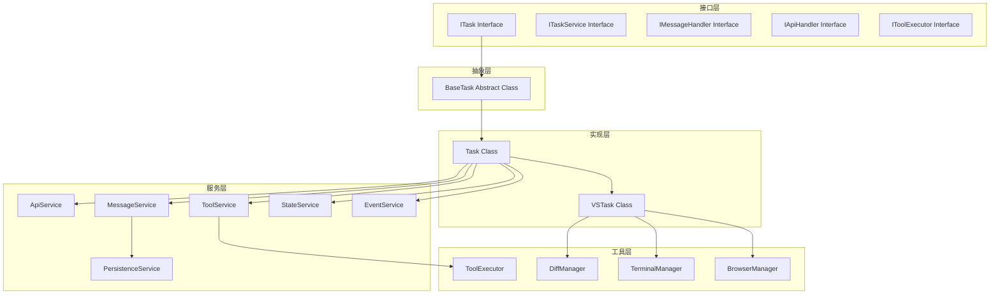
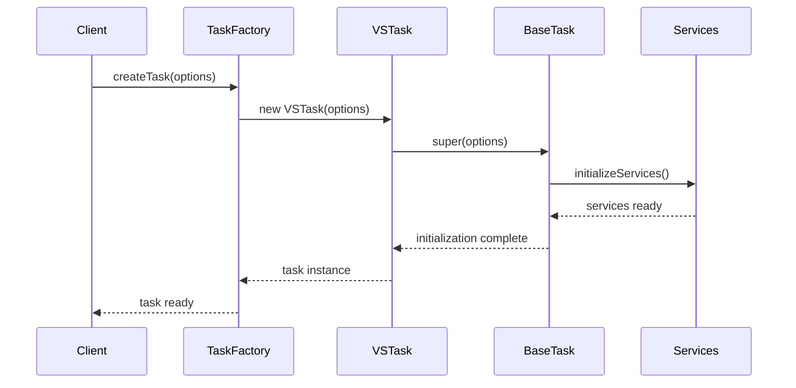
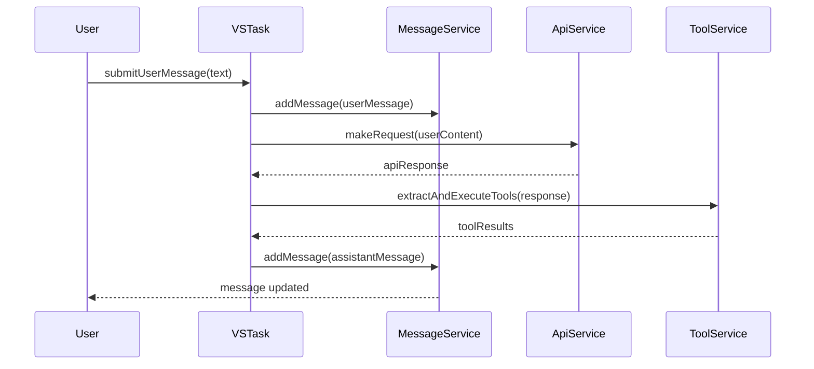
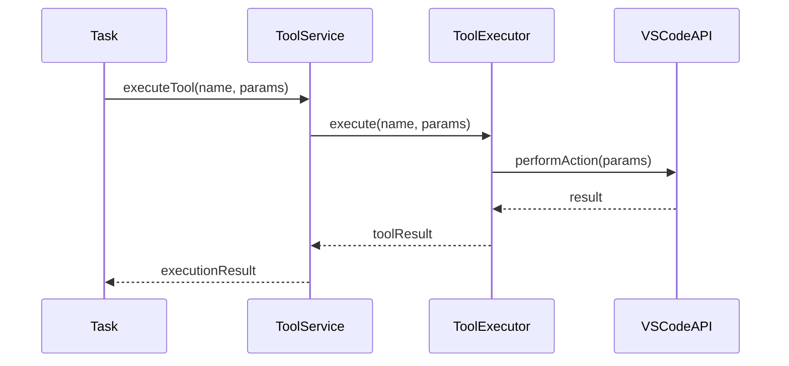
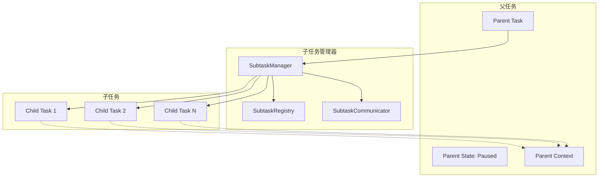
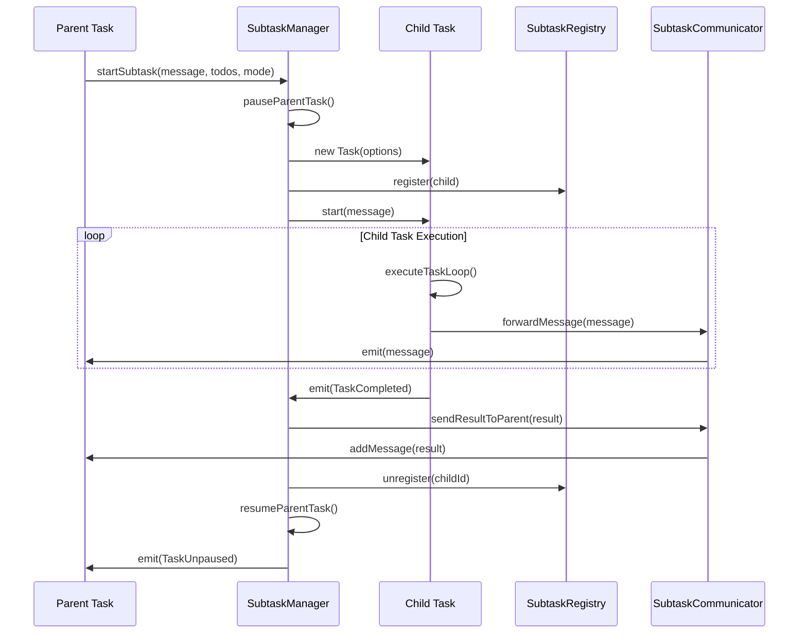

# Task类重构设计文档

## 概述

本设计文档详细描述了如何将现有的单体Task类重构为一个分层的、模块化的架构。重构的目标是将一个超过4000行的复杂类分解为多个职责明确、松耦合的组件，提高代码的可维护性、可测试性和可扩展性。

## 架构设计

### 整体架构图



## 组件设计

### 1. ITask接口

**职责：** 定义任务的核心契约和基本操作

**文件位置：** `src/core/task/interfaces/ITask.ts`

```typescript
export interface ITask extends EventEmitter<TaskEvents> {
	// 基本属性
	readonly taskId: string
	readonly rootTaskId?: string
	readonly parentTaskId?: string
	readonly childTaskId?: string
	readonly metadata: TaskMetadata
	readonly taskStatus: TaskStatus
	readonly workspacePath: string

	// 状态管理
	readonly isInitialized: boolean
	readonly isPaused: boolean
	readonly abort: boolean

	// 生命周期方法
	initialize(): Promise<void>
	start(task?: string, images?: string[]): Promise<void>
	pause(): Promise<void>
	resume(): Promise<void>
	abort(): Promise<void>
	dispose(): Promise<void>

	// 消息处理
	submitUserMessage(text: string, images?: string[], mode?: string): Promise<void>
	ask(type: ClineAsk, text?: string, isProtected?: boolean): Promise<ClineAskResponse>
	say(type: ClineSay, text?: string, images?: string[], partial?: boolean): Promise<void>

	// 任务管理
	startSubtask(message: string, initialTodos: TodoItem[], mode: string): Promise<ITask>
	waitForSubtask(): Promise<void>
	completeSubtask(lastMessage: string): Promise<void>

	// 工具执行
	executeTool(toolName: ToolName, params: any): Promise<any>

	// 状态查询
	getTokenUsage(): TokenUsage
	getToolUsage(): ToolUsage
	getTaskMode(): Promise<string>
}
```

### 2. BaseTask抽象类

**职责：** 提供任务的基础实现和通用功能

**文件位置：** `src/core/task/base/BaseTask.ts`

```typescript
export abstract class BaseTask extends EventEmitter<TaskEvents> implements ITask {
	// 基本属性实现
	readonly taskId: string
	readonly rootTaskId?: string
	readonly parentTaskId?: string
	childTaskId?: string
	readonly metadata: TaskMetadata
	readonly workspacePath: string

	// 状态管理
	protected _taskStatus: TaskStatus = TaskStatus.None
	protected _isInitialized: boolean = false
	protected _isPaused: boolean = false
	protected _abort: boolean = false

	// 服务依赖
	protected apiService: IApiService
	protected messageService: IMessageService
	protected stateService: IStateService
	protected eventService: IEventService

	constructor(options: BaseTaskOptions) {
		super()
		this.taskId = options.taskId || crypto.randomUUID()
		this.metadata = options.metadata
		this.workspacePath = options.workspacePath

		// 初始化服务
		this.initializeServices(options)
	}

	// 抽象方法 - 子类必须实现
	protected abstract initializeServices(options: BaseTaskOptions): void
	protected abstract executeTaskLoop(userContent: any[]): Promise<void>
	protected abstract handleToolExecution(toolName: ToolName, params: any): Promise<any>

	// 通用实现
	async initialize(): Promise<void> {
		if (this._isInitialized) return

		await this.initializeServices()
		this._isInitialized = true
		this.emit(RooCodeEventName.TaskStarted)
	}

	async start(task?: string, images?: string[]): Promise<void> {
		await this.initialize()
		await this.messageService.addMessage({
			type: "say",
			say: "text",
			text: task,
			images,
		})
		await this.executeTaskLoop([])
	}

	// 其他通用方法实现...
}
```

### 3. Task具体实现类

**职责：** 实现核心任务执行逻辑，专注于业务流程

**文件位置：** `src/core/task/Task.ts`

```typescript
export class Task extends BaseTask {
	// 任务特定的属性
	private toolService: IToolService
	private conversationMemory: ConversationMemory
	private vectorMemoryStore?: VectorMemoryStore

	// 执行状态
	private consecutiveMistakeCount: number = 0
	private toolUsage: ToolUsage = {}
	private assistantMessageContent: AssistantMessageContent[] = []

	constructor(options: TaskOptions) {
		super(options)
		this.initializeTaskSpecificServices(options)
	}

	protected initializeServices(options: TaskOptions): void {
		this.apiService = new ApiService(options.apiConfiguration)
		this.messageService = new MessageService(this.taskId, options.globalStoragePath)
		this.stateService = new StateService(this.taskId)
		this.eventService = new EventService()
		this.toolService = new ToolService(this)
	}

	private initializeTaskSpecificServices(options: TaskOptions): void {
		this.conversationMemory = new ConversationMemory(this.taskId)

		if (options.enableVectorMemory) {
			this.vectorMemoryStore = new VectorMemoryStore(options.vectorMemoryConfig)
		}
	}

	protected async executeTaskLoop(userContent: any[]): Promise<void> {
		let nextUserContent = userContent
		let includeFileDetails = true

		while (!this.abort) {
			const didEndLoop = await this.recursivelyMakeRequests(nextUserContent, includeFileDetails)
			includeFileDetails = false

			if (didEndLoop) {
				break
			} else {
				nextUserContent = [{ type: "text", text: formatResponse.noToolsUsed() }]
				this.consecutiveMistakeCount++
			}
		}
	}

	protected async handleToolExecution(toolName: ToolName, params: any): Promise<any> {
		return await this.toolService.executeTool(toolName, params)
	}

	private async recursivelyMakeRequests(userContent: any[], includeFileDetails: boolean): Promise<boolean> {
		// 简化的请求处理逻辑
		const response = await this.apiService.makeRequest(userContent)
		const toolCalls = this.extractToolCalls(response)

		if (toolCalls.length === 0) {
			return true // 没有工具调用，结束循环
		}

		for (const toolCall of toolCalls) {
			await this.handleToolExecution(toolCall.name, toolCall.params)
		}

		return false // 继续循环
	}

	// 其他任务特定方法...
}
```

### 4. VSTask扩展类

**职责：** 处理VSCode特定的功能和集成

**文件位置：** `src/core/task/VSTask.ts`

```typescript
export class VSTask extends Task {
	// VSCode特定的组件
	private diffManager: DiffManager
	private terminalManager: TerminalManager
	private browserManager: BrowserManager
	private diffViewProvider: DiffViewProvider

	// VSCode集成
	private provider: ClineProvider
	private context: vscode.ExtensionContext

	constructor(options: VSTaskOptions) {
		super(options)
		this.provider = options.provider
		this.context = options.context
		this.initializeVSCodeServices(options)
	}

	private initializeVSCodeServices(options: VSTaskOptions): void {
		this.diffManager = new DiffManager(this.workspacePath, this)
		this.terminalManager = new TerminalManager()
		this.browserManager = new BrowserManager(this.context)
		this.diffViewProvider = new DiffViewProvider(this.workspacePath, this)
	}

	// 重写工具执行以支持VSCode特定工具
	protected async handleToolExecution(toolName: ToolName, params: any): Promise<any> {
		switch (toolName) {
			case "str_replace":
				return await this.diffManager.applyStringReplace(params)
			case "bash":
				return await this.terminalManager.executeCommand(params)
			case "browser_action":
				return await this.browserManager.performAction(params)
			default:
				return await super.handleToolExecution(toolName, params)
		}
	}

	// VSCode特定的方法
	async showDiffView(filePath: string, changes: string): Promise<void> {
		await this.diffViewProvider.showDiff(filePath, changes)
	}

	async openTerminal(): Promise<void> {
		await this.terminalManager.createTerminal()
	}

	// 其他VSCode特定方法...
}
```

## 服务层设计

### 1. ApiService

**职责：** 处理所有API通信逻辑

```typescript
export class ApiService implements IApiService {
	private apiHandler: ApiHandler
	private conversationHistory: ApiMessage[] = []

	constructor(configuration: ProviderSettings) {
		this.apiHandler = buildApiHandler(configuration)
	}

	async makeRequest(userContent: any[]): Promise<ApiResponse> {
		// API请求逻辑
	}

	async addToHistory(message: ApiMessage): Promise<void> {
		// 历史记录管理
	}

	// 其他API相关方法...
}
```

### 2. MessageService

**职责：** 处理消息的创建、更新和持久化

```typescript
export class MessageService implements IMessageService {
	private messages: ClineMessage[] = []
	private taskId: string
	private globalStoragePath: string

	constructor(taskId: string, globalStoragePath: string) {
		this.taskId = taskId
		this.globalStoragePath = globalStoragePath
	}

	async addMessage(message: ClineMessage): Promise<void> {
		// 消息添加逻辑
	}

	async updateMessage(message: ClineMessage): Promise<void> {
		// 消息更新逻辑
	}

	async saveMessages(): Promise<void> {
		// 持久化逻辑
	}

	// 其他消息相关方法...
}
```

### 3. ToolService

**职责：** 管理工具执行和工具状态

```typescript
export class ToolService implements IToolService {
	private toolExecutor: IToolExecutor
	private toolUsage: ToolUsage = {}
	private repetitionDetector: ToolRepetitionDetector

	constructor(task: ITask) {
		this.toolExecutor = new ToolExecutor(task)
		this.repetitionDetector = new ToolRepetitionDetector()
	}

	async executeTool(toolName: ToolName, params: any): Promise<any> {
		// 工具执行逻辑
		this.repetitionDetector.recordToolUse(toolName)
		return await this.toolExecutor.execute(toolName, params)
	}

	getToolUsage(): ToolUsage {
		return { ...this.toolUsage }
	}

	// 其他工具相关方法...
}
```

### 4. StateService

**职责：** 管理任务状态和状态持久化

```typescript
export class StateService implements IStateService {
	private taskId: string
	private state: TaskState

	constructor(taskId: string) {
		this.taskId = taskId
		this.state = this.loadState()
	}

	async updateState(updates: Partial<TaskState>): Promise<void> {
		// 状态更新逻辑
	}

	async saveState(): Promise<void> {
		// 状态持久化逻辑
	}

	getState(): TaskState {
		return { ...this.state }
	}

	// 其他状态相关方法...
}
```

### 5. EventService

**职责：** 处理事件的发布和订阅

```typescript
export class EventService implements IEventService {
	private eventEmitter: EventEmitter

	constructor() {
		this.eventEmitter = new EventEmitter()
	}

	emit<K extends keyof TaskEvents>(event: K, ...args: TaskEvents[K]): void {
		this.eventEmitter.emit(event, ...args)
	}

	on<K extends keyof TaskEvents>(event: K, listener: (...args: TaskEvents[K]) => void): void {
		this.eventEmitter.on(event, listener)
	}

	off<K extends keyof TaskEvents>(event: K, listener: (...args: TaskEvents[K]) => void): void {
		this.eventEmitter.off(event, listener)
	}

	// 其他事件相关方法...
}
```

## 工具层设计

### 1. ToolExecutor

**职责：** 执行具体的工具操作

```typescript
export class ToolExecutor implements IToolExecutor {
	private task: ITask
	private toolHandlers: Map<ToolName, ToolHandler>

	constructor(task: ITask) {
		this.task = task
		this.initializeToolHandlers()
	}

	async execute(toolName: ToolName, params: any): Promise<any> {
		const handler = this.toolHandlers.get(toolName)
		if (!handler) {
			throw new Error(`Unknown tool: ${toolName}`)
		}

		return await handler.execute(params)
	}

	private initializeToolHandlers(): void {
		// 初始化各种工具处理器
	}
}
```

### 2. DiffManager

**职责：** 管理文件差异和编辑操作

```typescript
export class DiffManager {
	private workspacePath: string
	private task: ITask
	private diffStrategy: DiffStrategy

	constructor(workspacePath: string, task: ITask) {
		this.workspacePath = workspacePath
		this.task = task
		this.diffStrategy = new MultiSearchReplaceDiffStrategy()
	}

	async applyStringReplace(params: StringReplaceParams): Promise<string> {
		// 字符串替换逻辑
	}

	async applyDiff(filePath: string, diff: string): Promise<void> {
		// 差异应用逻辑
	}

	// 其他差异管理方法...
}
```

## 数据流设计

### 1. 任务创建流程



### 2. 消息处理流程



### 3. 工具执行流程



## 错误处理策略

### 1. 分层错误处理

- **接口层：** 定义错误类型和错误契约
- **服务层：** 处理服务特定的错误和恢复
- **工具层：** 处理工具执行错误和重试机制
- **任务层：** 协调整体错误处理和用户反馈

### 2. 错误恢复机制

```typescript
export class ErrorRecoveryManager {
	async handleApiError(error: ApiError): Promise<void> {
		if (error.type === "rate_limit") {
			await this.handleRateLimit(error)
		} else if (error.type === "context_window") {
			await this.handleContextWindow(error)
		}
		// 其他错误处理...
	}

	private async handleRateLimit(error: ApiError): Promise<void> {
		// 速率限制处理
	}

	private async handleContextWindow(error: ApiError): Promise<void> {
		// 上下文窗口处理
	}
}
```

## 性能优化设计

### 1. 内存管理

- **对象池：** 重用频繁创建的对象
- **弱引用：** 避免循环引用导致的内存泄漏
- **及时清理：** 在dispose方法中清理所有资源

### 2. 异步处理

- **批量操作：** 合并多个小操作为批量操作
- **并发控制：** 限制并发操作数量
- **流式处理：** 对大数据使用流式处理

### 3. 缓存策略

- **消息缓存：** 缓存最近的消息以减少磁盘IO
- **状态缓存：** 缓存任务状态以提高响应速度
- **工具结果缓存：** 缓存工具执行结果以避免重复计算

## 测试策略

### 1. 单元测试

- 每个类都有对应的单元测试
- 使用模拟对象隔离依赖
- 覆盖边界条件和错误场景

### 2. 集成测试

- 测试服务之间的协作
- 测试完整的任务执行流程
- 测试VSCode集成功能

### 3. 性能测试

- 测试任务启动时间
- 测试消息处理延迟
- 测试内存使用情况

## 子任务系统设计

### 1. 子任务架构

子任务系统是Task架构中的重要组成部分，需要支持任务的嵌套执行、状态管理和通信机制。



### 2. SubtaskManager设计

**职责：** 管理子任务的创建、执行、监控和通信

**文件位置：** `src/core/task/subtask/SubtaskManager.ts`

```typescript
export interface ISubtaskManager {
	// 子任务生命周期
	createSubtask(message: string, initialTodos: TodoItem[], mode: string): Promise<ITask>
	pauseParentTask(): Promise<void>
	resumeParentTask(): Promise<void>
	completeSubtask(subtaskId: string, result: string): Promise<void>

	// 子任务监控
	getActiveSubtasks(): ITask[]
	getSubtaskStatus(subtaskId: string): TaskStatus
	waitForSubtask(subtaskId: string): Promise<void>

	// 子任务通信
	sendMessageToSubtask(subtaskId: string, message: any): Promise<void>
	receiveMessageFromSubtask(subtaskId: string, message: any): Promise<void>
}

export class SubtaskManager implements ISubtaskManager {
	private parentTask: ITask
	private activeSubtasks: Map<string, ITask> = new Map()
	private subtaskRegistry: SubtaskRegistry
	private communicator: SubtaskCommunicator

	constructor(parentTask: ITask) {
		this.parentTask = parentTask
		this.subtaskRegistry = new SubtaskRegistry()
		this.communicator = new SubtaskCommunicator(parentTask)
	}

	async createSubtask(message: string, initialTodos: TodoItem[], mode: string): Promise<ITask> {
		// 1. 暂停父任务
		await this.pauseParentTask()

		// 2. 创建子任务
		const subtask = await this.createChildTask({
			message,
			initialTodos,
			mode,
			parentTask: this.parentTask,
		})

		// 3. 注册子任务
		this.subtaskRegistry.register(subtask)
		this.activeSubtasks.set(subtask.taskId, subtask)

		// 4. 设置子任务事件监听
		this.setupSubtaskEventListeners(subtask)

		// 5. 启动子任务
		await subtask.start(message)

		return subtask
	}

	async pauseParentTask(): Promise<void> {
		if (this.parentTask.taskStatus !== TaskStatus.Running) {
			return
		}

		// 保存父任务当前状态
		await this.saveParentTaskState()

		// 暂停父任务
		this.parentTask.isPaused = true
		this.parentTask.emit(RooCodeEventName.TaskPaused, this.parentTask.taskId)
	}

	async resumeParentTask(): Promise<void> {
		if (!this.parentTask.isPaused) {
			return
		}

		// 恢复父任务状态
		await this.restoreParentTaskState()

		// 恢复父任务执行
		this.parentTask.isPaused = false
		this.parentTask.emit(RooCodeEventName.TaskUnpaused, this.parentTask.taskId)
	}

	async completeSubtask(subtaskId: string, result: string): Promise<void> {
		const subtask = this.activeSubtasks.get(subtaskId)
		if (!subtask) {
			throw new Error(`Subtask ${subtaskId} not found`)
		}

		// 1. 清理子任务
		await this.cleanupSubtask(subtask)

		// 2. 将结果传递给父任务
		await this.communicator.sendResultToParent(result)

		// 3. 恢复父任务
		await this.resumeParentTask()

		// 4. 从注册表中移除
		this.subtaskRegistry.unregister(subtaskId)
		this.activeSubtasks.delete(subtaskId)
	}

	private async createChildTask(options: SubtaskOptions): Promise<ITask> {
		// 根据父任务类型创建相应的子任务
		if (this.parentTask instanceof VSTask) {
			return new VSTask({
				...options,
				parentTask: this.parentTask,
				provider: this.parentTask.provider,
				context: this.parentTask.context,
			})
		} else {
			return new Task({
				...options,
				parentTask: this.parentTask,
			})
		}
	}

	private setupSubtaskEventListeners(subtask: ITask): void {
		// 监听子任务完成事件
		subtask.on(RooCodeEventName.TaskCompleted, async (taskId, tokenUsage, toolUsage) => {
			await this.completeSubtask(taskId, "Task completed successfully")
		})

		// 监听子任务错误事件
		subtask.on(RooCodeEventName.TaskAborted, async () => {
			await this.completeSubtask(subtask.taskId, "Task was aborted")
		})

		// 监听子任务消息事件
		subtask.on(RooCodeEventName.Message, (messageEvent) => {
			this.communicator.forwardMessageToParent(messageEvent.message)
		})
	}

	// 其他方法实现...
}
```

### 3. SubtaskRegistry设计

**职责：** 管理子任务的注册、查找和状态跟踪

```typescript
export class SubtaskRegistry {
	private subtasks: Map<string, SubtaskInfo> = new Map()
	private parentChildMap: Map<string, Set<string>> = new Map()

	register(subtask: ITask): void {
		const info: SubtaskInfo = {
			task: subtask,
			createdAt: Date.now(),
			status: subtask.taskStatus,
			parentId: subtask.parentTaskId,
		}

		this.subtasks.set(subtask.taskId, info)

		// 更新父子关系映射
		if (subtask.parentTaskId) {
			if (!this.parentChildMap.has(subtask.parentTaskId)) {
				this.parentChildMap.set(subtask.parentTaskId, new Set())
			}
			this.parentChildMap.get(subtask.parentTaskId)!.add(subtask.taskId)
		}
	}

	unregister(subtaskId: string): void {
		const info = this.subtasks.get(subtaskId)
		if (info && info.parentId) {
			const siblings = this.parentChildMap.get(info.parentId)
			if (siblings) {
				siblings.delete(subtaskId)
				if (siblings.size === 0) {
					this.parentChildMap.delete(info.parentId)
				}
			}
		}

		this.subtasks.delete(subtaskId)
	}

	getSubtask(subtaskId: string): ITask | undefined {
		return this.subtasks.get(subtaskId)?.task
	}

	getChildTasks(parentId: string): ITask[] {
		const childIds = this.parentChildMap.get(parentId)
		if (!childIds) return []

		return Array.from(childIds)
			.map((id) => this.subtasks.get(id)?.task)
			.filter((task) => task !== undefined) as ITask[]
	}

	getAllSubtasks(): ITask[] {
		return Array.from(this.subtasks.values()).map((info) => info.task)
	}
}

interface SubtaskInfo {
	task: ITask
	createdAt: number
	status: TaskStatus
	parentId?: string
}
```

### 4. SubtaskCommunicator设计

**职责：** 处理父子任务之间的通信和数据传递

```typescript
export class SubtaskCommunicator {
	private parentTask: ITask
	private messageQueue: SubtaskMessage[] = []

	constructor(parentTask: ITask) {
		this.parentTask = parentTask
	}

	async sendResultToParent(result: string): Promise<void> {
		// 将子任务结果添加到父任务的消息历史
		await this.parentTask.say("subtask_result", result)

		// 更新父任务的API对话历史
		const apiMessage = {
			role: "user" as const,
			content: [
				{
					type: "text" as const,
					text: `[subtask completed] Result: ${result}`,
				},
			],
		}

		await this.parentTask.addToApiConversationHistory(apiMessage)
	}

	forwardMessageToParent(message: ClineMessage): void {
		// 将子任务的重要消息转发给父任务
		if (this.shouldForwardMessage(message)) {
			const forwardedMessage: SubtaskMessage = {
				type: "forwarded",
				originalMessage: message,
				subtaskId: message.taskId || "unknown",
				timestamp: Date.now(),
			}

			this.messageQueue.push(forwardedMessage)
			this.parentTask.emit(RooCodeEventName.Message, {
				action: "created",
				message: this.createForwardedMessage(forwardedMessage),
			})
		}
	}

	private shouldForwardMessage(message: ClineMessage): boolean {
		// 只转发重要的消息类型
		if (message.type === "say") {
			return ["error", "completion_result", "tool_result"].includes(message.say)
		}
		return false
	}

	private createForwardedMessage(subtaskMessage: SubtaskMessage): ClineMessage {
		return {
			ts: subtaskMessage.timestamp,
			type: "say",
			say: "subtask_message",
			text: `[Subtask ${subtaskMessage.subtaskId}] ${subtaskMessage.originalMessage.text}`,
			images: subtaskMessage.originalMessage.images,
		}
	}
}

interface SubtaskMessage {
	type: "forwarded" | "result" | "error"
	originalMessage: ClineMessage
	subtaskId: string
	timestamp: number
}
```

### 5. 子任务状态管理

```typescript
export class SubtaskStateManager {
	private parentTask: ITask
	private savedState: ParentTaskState | null = null

	constructor(parentTask: ITask) {
		this.parentTask = parentTask
	}

	async saveParentState(): Promise<void> {
		this.savedState = {
			taskStatus: this.parentTask.taskStatus,
			currentMode: await this.parentTask.getTaskMode(),
			lastMessageTs: this.parentTask.lastMessageTs,
			conversationHistory: [...this.parentTask.apiConversationHistory],
			clineMessages: [...this.parentTask.clineMessages],
			toolUsage: { ...this.parentTask.getToolUsage() },
			tokenUsage: { ...this.parentTask.getTokenUsage() },
		}
	}

	async restoreParentState(): Promise<void> {
		if (!this.savedState) {
			throw new Error("No saved parent state to restore")
		}

		// 恢复父任务的关键状态
		this.parentTask.lastMessageTs = this.savedState.lastMessageTs

		// 注意：不完全恢复对话历史，因为子任务的结果需要保留
		// 只恢复必要的状态信息
	}

	clearSavedState(): void {
		this.savedState = null
	}
}

interface ParentTaskState {
	taskStatus: TaskStatus
	currentMode: string
	lastMessageTs?: number
	conversationHistory: ApiMessage[]
	clineMessages: ClineMessage[]
	toolUsage: ToolUsage
	tokenUsage: TokenUsage
}
```

### 6. 子任务执行流程



### 7. 子任务集成到主架构

在BaseTask中添加子任务支持：

```typescript
export abstract class BaseTask extends EventEmitter<TaskEvents> implements ITask {
	// 子任务管理
	protected subtaskManager: ISubtaskManager
	protected childTaskId?: string
	protected isPaused: boolean = false

	constructor(options: BaseTaskOptions) {
		super()
		// ... 其他初始化代码

		// 初始化子任务管理器
		this.subtaskManager = new SubtaskManager(this)
	}

	// 子任务相关方法
	async startSubtask(message: string, initialTodos: TodoItem[], mode: string): Promise<ITask> {
		const subtask = await this.subtaskManager.createSubtask(message, initialTodos, mode)
		this.childTaskId = subtask.taskId
		return subtask
	}

	async waitForSubtask(): Promise<void> {
		if (!this.childTaskId) {
			throw new Error("No active subtask to wait for")
		}

		await this.subtaskManager.waitForSubtask(this.childTaskId)
	}

	async completeSubtask(lastMessage: string): Promise<void> {
		if (!this.childTaskId) {
			throw new Error("No active subtask to complete")
		}

		await this.subtaskManager.completeSubtask(this.childTaskId, lastMessage)
		this.childTaskId = undefined
	}

	// 重写执行循环以支持子任务暂停/恢复
	protected async executeTaskLoop(userContent: any[]): Promise<void> {
		while (!this.abort) {
			// 检查是否需要等待子任务
			if (this.isPaused && this.childTaskId) {
				await this.waitForSubtask()
				continue
			}

			// 正常的任务执行逻辑
			const didEndLoop = await this.processTaskIteration(userContent)
			if (didEndLoop) break
		}
	}

	protected abstract processTaskIteration(userContent: any[]): Promise<boolean>
}
```

## 迁移策略

### 1. 向后兼容性

- 保持现有公共API不变
- 使用适配器模式处理接口变更
- 渐进式迁移，避免破坏性变更

### 2. 迁移步骤

1. **第一阶段：** 创建新的接口和抽象类
2. **第二阶段：** 实现服务层组件
3. **第三阶段：** 重构Task类使用新服务
4. **第四阶段：** 创建VSTask扩展类
5. **第五阶段：** 迁移现有代码使用新架构
6. **第六阶段：** 清理旧代码和优化

### 3. 风险控制

- 使用特性开关控制新功能的启用
- 保留旧代码作为回退方案
- 分阶段发布，逐步验证稳定性
